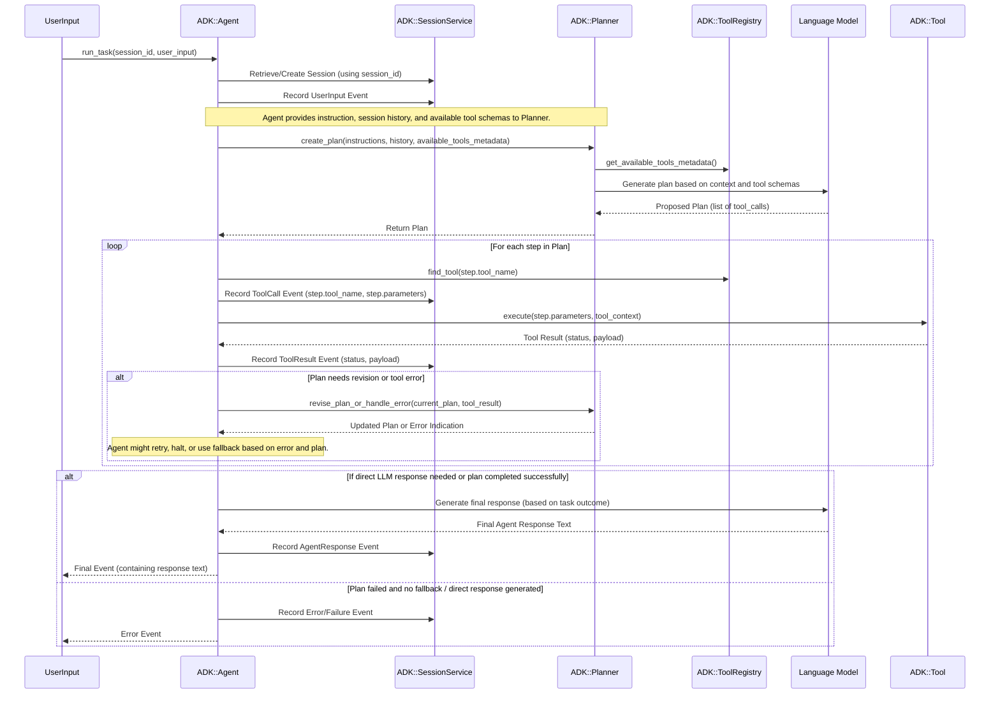

# ADK Agent Lifecycle and Internals

This document details the lifecycle, definition, and internal workings of an `ADK::Agent`, the core component responsible for orchestrating task execution in the ADK framework.

## 1. Introduction to `ADK::Agent`

The `ADK::Agent` class is the heart of any ADK-powered application. Its primary responsibilities include:

*   Loading and interpreting its configuration (agent definition).
*   Managing its set of available tools.
*   Interacting with a `Planner` to create a sequence of actions (plan) to address a user's task.
*   Executing the steps in the plan, which typically involve calling tools.
*   Managing conversation state and history through a `SessionService`.
*   Potentially interacting with a Language Model (LLM) for final response generation.

## 2. Agent Definition

An agent's behavior and capabilities are determined by its definition. This definition can be created programmatically, via the ADK CLI, or loaded from a `DefinitionStore` (commonly Redis).

Key attributes of an agent definition include:

*   **`name` (Symbol/String):** A unique identifier for the agent.
*   **`description` (String):** A human-readable description of what the agent does. This can be used by meta-agents or discovery services.
*   **`instruction` (String):** The core set of instructions or system prompt that guides the agent's behavior and how it should approach tasks. This is crucial for the `Planner` and LLM interactions.
*   **`model_name` (String):** Specifies the Language Model to be used by the planner and for response generation (e.g., 'gemini-1.5-pro-latest', 'gpt-4o').
*   **`tool_classes` (Array<Class>):** (Primarily for programmatic definition) An array of `ADK::Tool` classes that this agent can use directly.
*   **`tools` (Array<Symbol/String>):** (Primarily for stored definitions) An array of tool names that the agent should load from the `ADK::GlobalToolManager`.
*   **`mcp_servers` (Array<Hash>):** Configuration for connecting to external MCP servers to use their tools. (See `public/docs/mcp_client_integration.md`).
*   **`webhook_enabled` (Boolean):** If true, allows this agent to be triggered by inbound webhooks. (See `public/docs/configuring_agent_webhooks.md`).
*   **`webhook_transformer`, `webhook_session_extractor`, `webhook_validator`, `webhook_secret`:** Configuration related to how the agent processes incoming webhook data.
*   **`fallback_mode` (Symbol):** Defines behavior when no plan can be made or a tool fails (e.g., `:error`, `:llm_fallback`).

**Example Programmatic Definition:**

```ruby
require 'adk'
require 'adk/tools/calculator'

my_calculator_agent = ADK::Agent.new(
  name: :simple_calculator,
  instruction: "You are a helpful assistant that uses a calculator to answer math questions.",
  tool_classes: [ADK::Tools::Calculator]
)
```

## 3. Agent Initialization and Startup (`agent.start`)

When an `ADK::Agent` instance is created or loaded, it typically needs to be explicitly started before it can execute tasks.

The `agent.start` method performs several key setup operations:

1.  **Loads its full definition** (if not already fully populated at instantiation, e.g., when loaded by name from a `DefinitionStore`).
2.  **Initializes its `ToolRegistry`**: Each agent instance has its own `ToolRegistry`.
3.  **Registers Native Tools**: If `tool_classes` were provided or tool names were specified in its definition, it attempts to load these tool classes (often from `ADK::GlobalToolManager`) and registers instances or factories with its local `ToolRegistry`.
4.  **Connects to MCP Servers**: If `mcp_servers` are configured:
    *   It establishes connections to each external MCP server.
    *   It retrieves the list of available tools from each server.
    *   It wraps selected MCP tools (as specified by `selected_tool_names` in the agent definition) using `ADK::Mcp::ToolWrapper` and registers them in its local `ToolRegistry`.
5.  Sets its status to `running`.

## 4. Task Execution (`agent.run_task`)

The `agent.run_task(session_id:, user_input:, session_service:)` method is the primary entry point for an agent to perform a task. The typical internal flow is as follows:



**Key Interactions during `run_task`:**

*   **`ADK::SessionService`**: The agent first retrieves the current session (or creates a new one) using the provided `session_id`. Throughout the task, it records all significant events (user input, tool calls, tool results, agent responses) into the session via the `SessionService`.
*   **`ADK::Planner`**: The agent delegates the core task of figuring out *how* to accomplish the `user_input` to the `Planner`. It provides the planner with its own `instruction` prompt, the `session_history` (retrieved from `SessionService`), and a list of available tools with their metadata (from its `ToolRegistry`). The planner often uses an LLM to generate a sequence of steps (tool calls).
*   **`ADK::ToolRegistry`**: When the planner returns a plan, the agent uses its `ToolRegistry` to get actual instances of the tools specified in each step of the plan.
*   **`ADK::Tool`**: The agent calls the `execute` method on each tool instance, passing the required parameters from the plan and a `ToolContext` object. The `ToolContext` provides the tool with access to session information and the `SessionService` if needed.
*   **LLM (Language Model)**: Beyond planning, the agent might directly use an LLM to generate a final, conversational response to the user after all tool executions are complete, or if the task doesn't require tools.
*   **Error Handling & Fallbacks**: If a tool call fails, or the planner cannot create a satisfactory plan, the agent's `fallback_mode` and internal logic determine the next steps (e.g., try to re-plan, use a default LLM response, or return an error).

The result of `run_task` is typically the final `ADK::Event` generated by the agent (e.g., an event with `role: :agent` containing the textual response).

## 5. Agent Shutdown (`agent.stop`)

When an agent is no longer needed or the application is shutting down, the `agent.stop` method should be called.

This method primarily handles:

1.  **Disconnecting from MCP Servers**: If the agent was connected to any external MCP servers, `agent.stop` calls `disconnect` on each `ADK::Mcp::Client` instance.
2.  **Releasing Resources**: Any other resources held by the agent or its tools might be released.
3.  Sets its status to `stopped`.

Properly stopping an agent ensures clean termination of external connections and prevents resource leaks.

## 6. Understanding Events (`ADK::Event`)

Every significant interaction during an agent's task execution is recorded as an `ADK::Event`. These events form the chronological history stored within an agent's session by the `ADK::SessionService`.

Events are immutable objects (frozen after creation) represented by the `ADK::Event` struct. Key attributes include:

*   **`event_id` (String):** A unique identifier (UUID) for this specific event instance.
*   **`timestamp` (Time):** The UTC timestamp indicating when the event occurred (defaults to `Time.now.utc`).
*   **`role` (Symbol):** Indicates the originator or type of the event. Common roles include:
    *   `:user`: Represents input provided by the user.
    *   `:agent`: Represents a response generated by the agent.
    *   `:tool_request`: Represents the agent's decision to call a tool, including the parameters.
    *   `:tool_result`: Represents the outcome returned by a tool after execution.
*   **`content` (String | Hash | Array | Numeric | Boolean | Nil):** The main payload of the event. This varies depending on the role:
    *   For `:user` and `:agent`: Typically a String containing the message text.
    *   For `:tool_request`: Typically a Hash containing the parameters passed to the tool.
    *   For `:tool_result`: Typically a Hash containing the status hash returned by the tool's `perform_execution` (e.g., `{status: :success, result: ...}`).
*   **`tool_name` (Symbol | nil):** Present for `:tool_request` and `:tool_result` events, indicating the symbolic name of the tool involved.
*   **`state_delta` (Hash | nil):** An optional hash representing state changes associated specifically with this event. Keys should be symbols. This allows for tracking or applying state modifications tied to specific interactions (its usage is less common in basic flows).

The sequence of these events, retrieved via `SessionService.get_session_history`, provides the full context for the `ADK::Planner` and agent decision-making.

Events are designed to be serializable (via `to_h`) for storage, particularly by the `RedisSessionService`, and deserializable (via `from_h`).

## Further Reading

*   [`adk_architecture_overview.md`](./adk_architecture_overview.md)
*   [`adk_tools_and_registry.md`](./adk_tools_and_registry.md) (Coming Soon)
*   For specific features: `mcp_client_integration.md`, `configuring_agent_webhooks.md`. 