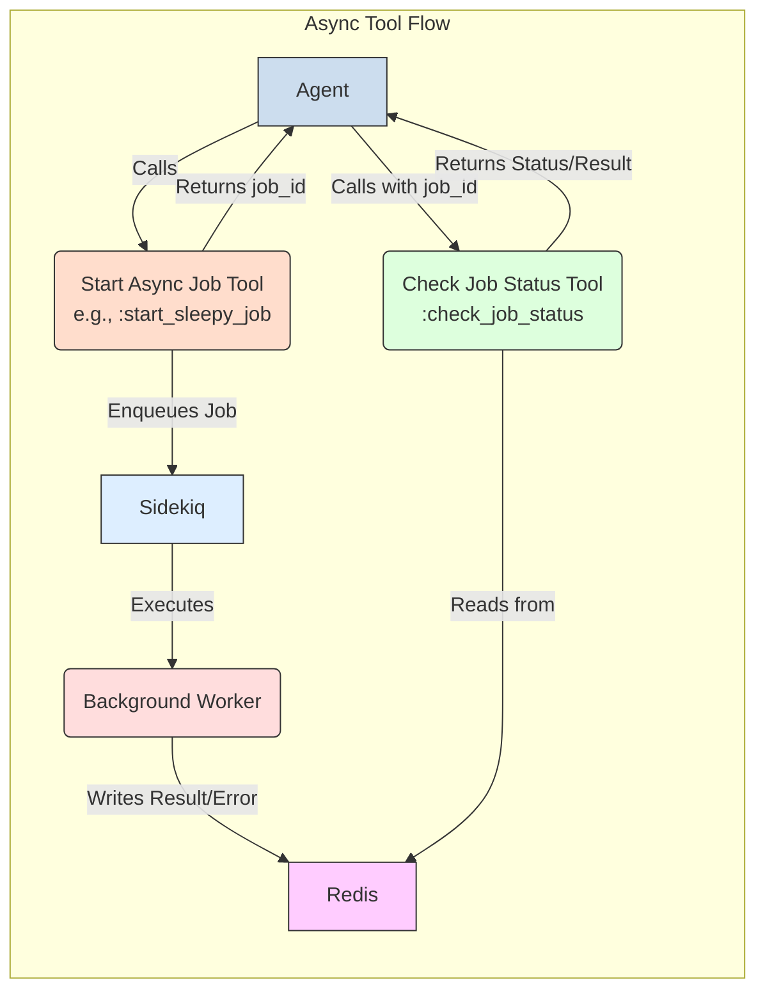

# ADK Built-in Tools

This document serves as a reference guide for the common tools included with the ADK. These tools are available for agents to use once registered.

## General Usage Notes

*   **Tool Naming**: When adding tools to an agent definition, you typically use their inferred snake_case name (e.g., `:calculator`, `:echo_tool`) unless an `explicit_tool_name` is specified in the tool's class.
*   **Parameters**: Each tool defines its expected parameters, including their type and whether they are required.
*   **Return Value**: Successful tool executions generally return a hash with `status: :success` and a `result` field. Errors usually result in an `ADK::ToolError` or return a hash with `status: :error` and an `error_message`.

---

## Calculator

*   **Tool Name**: `:calculator` (inferred)
*   **Purpose**: Calculates the result of an arithmetic operation.
*   **Parameters**:
    *   `operand1` (numeric, required): The first number for the calculation.
    *   `operand2` (numeric, required): The second number for the calculation.
    *   `operation` (string, required): The operation to perform (e.g., "add", "subtract", "multiply", "divide", or symbols `+`, `-`, `*`, `/`).
*   **Example Invocation (Conceptual)**:
    ```json
    {
      "tool_name": "calculator",
      "parameters": {
        "operand1": 10,
        "operand2": 5,
        "operation": "multiply"
      }
    }
    ```
*   **Example Success Response**:
    ```json
    {
      "status": "success",
      "result": 50
    }
    ```

---

## Echo

*   **Tool Name**: `:echo` (inferred from class `Echo` -> `ADK::Tools::Echo`)
*   **Purpose**: Echoes back the provided message.
*   **Parameters**:
    *   `message` (string, required): The message to echo.
*   **Example Invocation (Conceptual)**:
    ```json
    {
      "tool_name": "echo",
      "parameters": {
        "message": "Hello, world!"
      }
    }
    ```
*   **Example Success Response**:
    ```json
    {
      "status": "success",
      "result": "Hello, world!"
    }
    ```

---

## CatFacts

*   **Tool Name**: `:cat_facts` (inferred)
*   **Purpose**: Fetches a random cat fact from an online API (`https://catfact.ninja`).
*   **Parameters**: None.
*   **Example Invocation (Conceptual)**:
    ```json
    {
      "tool_name": "cat_facts",
      "parameters": {}
    }
    ```
*   **Example Success Response**:
    ```json
    {
      "status": "success",
      "result": "Cats have over 20 muscles that control their ears."
    }
    ```

---

## WebhookTool

*   **Tool Name**: `:webhook_tool` (explicitly set)
*   **Purpose**: Sends an HTTP POST request with a JSON payload to a specified webhook URL. Can optionally sign the request using HMAC-SHA256.
*   **Parameters**:
    *   `url` (string, required): The target webhook URL.
    *   `payload` (hash or string, required): The data payload to send. Hash payloads are automatically JSON-encoded with `Content-Type: application/json`.
    *   `secret` (string, optional): Optional secret key for calculating HMAC-SHA256 signature (sent in `X-Hub-Signature-256` header).
    *   `headers` (hash, optional): Optional custom headers to include (e.g., `Content-Type` for string payloads).
*   **Example Invocation (Conceptual)**:
    ```json
    {
      "tool_name": "webhook_tool",
      "parameters": {
        "url": "https://example.com/my-hook",
        "payload": {"data": "some_value", "event": "item_created"},
        "secret": "mysecretkey"
      }
    }
    ```
*   **Example Success Response**:
    ```json
    {
      "status": "success",
      "result": {
        "response_status": 200,
        "response_body": "Webhook received successfully"
      }
    }
    ```

---

## AgentTool (Delegate Task)

*   **Tool Name**: `:delegate_task` (explicitly set, class `AgentTool`)
*   **Purpose**: Delegates a specified task to another agent identified by its unique name. This is useful when a specific, pre-defined agent is better suited for a sub-task.
*   **Parameters**:
    *   `target_agent_name` (string, required): The unique name of the agent definition (must be findable by `ADK::AgentDefinitionStore`) to delegate the task to.
    *   `task` (string, required): The specific task description to be executed by the target agent.
*   **Example Invocation (Conceptual)**:
    ```json
    {
      "tool_name": "delegate_task",
      "parameters": {
        "target_agent_name": "customer_service_agent",
        "task": "The user is asking for a refund for order 12345. Please process this."
      }
    }
    ```
*   **Example Success Response** (depends on the target agent's response):
    ```json
    {
      "status": "success",
      "result": "The refund for order 12345 has been processed successfully."
    }
    ```

---

## Asynchronous Operations Tools

ADK provides a mechanism for tools to initiate long-running tasks as background jobs using Sidekiq. This typically involves two tools: one to start the job and one to check its status.

### BaseAsyncJobTool (Developer Note)
This is an abstract base class (`ADK::Tools::BaseAsyncJobTool`) and not directly invoked by an agent. Developers creating new asynchronous tools would inherit from it. It handles the common logic of enqueuing jobs to Sidekiq and provides helpers for storing job results in Redis.

### SleepyTool (Example Async Tool)

*   **Tool Name**: `:start_sleepy_job` (explicitly set, class `SleepyTool`)
*   **Purpose**: Starts a background job that simply sleeps for a specified duration and then records a message. This tool is primarily an example of an asynchronous tool.
*   **Parameters**:
    *   `duration` (integer, required): How many seconds the job should sleep.
    *   `message` (string, required): A message to include in the final result upon job completion.
*   **Invocation Result**: When this tool is called, it enqueues a Sidekiq job.
    *   **Example Success Response (Job Enqueued)**:
        ```json
        {
          "status": "pending",
          "job_id": "abcdef1234567890"
        }
        ```
*   **Getting the Actual Result**: Use the `check_job_status` tool with the returned `job_id`.

### CheckJobStatusTool

*   **Tool Name**: `:check_job_status` (explicitly set, class `CheckJobStatusTool`)
*   **Purpose**: Checks the status and retrieves the result of a previously started background job (Sidekiq) using its `job_id`.
*   **Parameters**:
    *   `job_id` (string, required): The ID of the job to check (obtained from a tool like `start_sleepy_job`).
*   **Response Scenarios**:
    *   **Job Pending**:
        ```json
        {
          "status": "pending",
          "job_id": "abcdef1234567890",
          "message": "Job is queued or currently running."
        }
        ```
    *   **Job Succeeded** (result from Redis, originally stored by the worker):
        ```json
        {
          "status": "success",
          "job_id": "abcdef1234567890",
          "result": "Slept for 10 seconds. Your message: Hello from async job."
        }
        ```
    *   **Job Errored** (error from Redis, originally stored by the worker):
        ```json
        {
          "status": "error",
          "job_id": "abcdef1234567890",
          "error_message": "Something went wrong during the job.",
          "error_details": "Optional details about the error, like exception class."
        }
        ```
    *   **Job Failed in Sidekiq (e.g., in Dead Set)**: The tool call itself might raise an `ADK::ToolError` or return a generic error status.
    *   **Job Not Found/Expired**: The tool call might raise an `ADK::ToolError` or return an error status indicating the result is unavailable.

---

## RandomNumberTool

*   **Tool Name**: `:random_number` (explicitly set, class `RandomNumberTool`)
*   **Purpose**: Generates a random integer between a minimum and maximum value (inclusive). Defaults to generating a number between 1 and 100 if no parameters are provided.
*   **Parameters**:
    *   `min` (integer, optional): The minimum value for the random number (inclusive). Defaults to 1.
    *   `max` (integer, optional): The maximum value for the random number (inclusive). Defaults to 100.
*   **Example Invocation (Conceptual)**:
    ```json
    {
      "tool_name": "random_number",
      "parameters": {
        "min": 10,
        "max": 20
      }
    }
    ```
*   **Example Success Response**:
    ```json
    {
      "status": "success",
      "result": 15
    }
    ```

