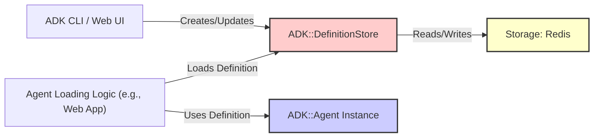

# ADK Definition Store

This document explains the purpose and usage of the Definition Store in the ADK framework, which is responsible for persisting and retrieving agent definitions.

## 1. Purpose

An agent's definition contains its core configuration: name, instructions, description, associated tools, model configuration, webhook settings, etc. While agents can be defined purely in code, storing these definitions externally allows:

*   Creating and managing agents via tools like the ADK CLI or Web UI without modifying application code.
*   Dynamically loading agent configurations at runtime.
*   Sharing agent definitions between different processes (e.g., web server and background workers).

The Definition Store provides the abstraction for this persistence.

## 2. Architecture Overview



*   User interfaces (like the ADK CLI or Web UI) interact with the `DefinitionStore` to save, update, or list agent definitions.
*   Application components that need to run specific agents (like the ADK Web App or a custom script) use the `DefinitionStore` to retrieve the definition by name.
*   The retrieved definition data is then used to initialize an `ADK::Agent` instance.
*   The most common implementation, `ADK::DefinitionStore::RedisStore`, uses Redis as the backend storage.

## 3. `ADK::DefinitionStore::RedisStore`

This is the primary implementation provided by ADK.

### 3.1. Initialization

You typically don't configure the Definition Store globally via `ADK.configure`. Instead, you instantiate `RedisStore` where needed, usually passing in a Redis client instance. If no client is provided, it attempts to create one using the globally configured `ADK.redis_options`.

```ruby
require 'adk/definition_store/redis_store'

# Option 1: Use default Redis connection (from ADK.config.redis_options)
definition_store = ADK::DefinitionStore::RedisStore.new

# Option 2: Provide a specific Redis client instance
my_redis_client = Redis.new(url: ENV['MY_SEPARATE_REDIS_URL'])
definition_store = ADK::DefinitionStore::RedisStore.new(redis_client: my_redis_client)
```

### 3.2. Core Methods

*   **`save_definition(name:, description:, instruction:, tools:, model:, ...other_fields)`**: Saves or updates a complete agent definition. It takes keyword arguments corresponding to the agent attributes.
*   **`get_definition(agent_name) -> Hash | nil`**: Retrieves the definition for a given agent name as a Hash with symbolized keys. Returns `nil` if not found.
*   **`update_definition(agent_name, updates_hash) -> Boolean`**: Updates specific fields of an existing definition. `updates_hash` contains the fields (as keys) and new values to set.
*   **`delete_definition(agent_name) -> Boolean`**: Removes an agent definition.
*   **`list_definitions -> Array<Hash>`**: Returns an array of hashes, where each hash represents a summary of an agent definition (often including name, description, model, persistent_status).
*   **`definition_exists?(agent_name) -> Boolean`**: Checks if a definition exists for the given name.

### 3.3. Redis Schema

`RedisStore` stores agent definitions using specific keys in Redis:

*   **`adk:agents:all_names` (Set):** Stores the names of all defined agents. Used for listing and existence checks.
*   **`adk:agent:<agent_name>` (Hash):** Stores the actual definition data for a specific agent. The fields within this hash correspond to the agent attributes (e.g., `description`, `instruction`, `tools` (as JSON string), `model`, `webhook_enabled`, `persistent_status`, etc.).

The exact prefix (`adk:agent:`) can potentially be influenced by configuration, but this is the default structure.

## 4. Usage Examples

### Saving a New Definition

```ruby
store = ADK::DefinitionStore::RedisStore.new

success = store.save_definition(
  name: "my_new_agent",
  description: "An agent created via the store.",
  instruction: "Be helpful.",
  tools: ["calculator", "echo"], # Tool names as strings or symbols
  model: "gemini-1.5-pro-latest",
  webhook_enabled: false,
  persistent_status: "stopped" # Added for persistent status feature
)

if success
  puts "Agent definition saved."
else
  puts "Failed to save agent definition."
end
```

### Retrieving and Using a Definition

```ruby
store = ADK::DefinitionStore::RedisStore.new
agent_name = "my_new_agent"

definition = store.get_definition(agent_name)

if definition
  puts "Found definition: #{definition.inspect}"
  
  # Find tool classes based on names in the definition
  tool_classes_to_load = definition[:tools].map do |tool_name|
    ADK::GlobalToolManager.find_class(tool_name.to_sym)
  end.compact
  
  # Instantiate the agent using the definition data
  agent_instance = ADK::Agent.new(
    name: definition[:name],
    description: definition[:description],
    instruction: definition[:instruction],
    model_name: definition[:model],
    tool_classes: tool_classes_to_load,
    # Pass other relevant fields from definition if needed
  )
  puts "Agent instance created: #{agent_instance.name}"
  # agent_instance.start # Start the agent if needed
else
  puts "Agent definition '#{agent_name}' not found."
end
```

### Updating a Field

```ruby
store = ADK::DefinitionStore::RedisStore.new

success = store.update_definition("my_new_agent", { description: "Updated description." })

puts success ? "Description updated." : "Failed to update description."
```

## Further Reading

*   [`adk_architecture_overview`](./adk_architecture_overview)
*   [`adk_agent_lifecycle`](./adk_agent_lifecycle)
*   [`adk_configuration`](./adk_configuration) (for default Redis config)
