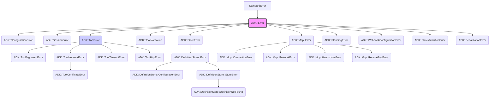

# ADK Error Handling

This guide covers common ADK-specific exception classes and provides an overview of potential error scenarios and how they are typically handled within the framework.

## Philosophy

ADK aims to use specific error classes to help developers pinpoint the source and nature of issues. When tools encounter problems, they should generally raise an appropriate `ADK::ToolError` subclass rather than returning an error status in their result hash. The ADK agent runtime is designed to catch these exceptions and format them into a standard error event for the LLM.

## Core Exception Hierarchy

Most ADK-specific errors inherit from `ADK::Error < StandardError`.

## Key ADK Exception Classes

### 1. `ADK::ConfigurationError`
*   **Purpose**: Raised when there's an issue with the ADK framework's configuration. This could be due to missing required settings, invalid values for configuration parameters (e.g., in `ADK.configure` blocks or environment variables that ADK relies on).
*   **Example Scenarios**: Invalid Redis URL, misconfigured session service type.
*   **Typically Handled By**: Application startup checks; often fatal if core services cannot be initialized.

### 2. `ADK::SessionError`
*   **Purpose**: Raised during issues related to session management. This includes problems creating, retrieving, updating, or deleting agent-user interaction sessions managed by an `ADK::SessionService` implementation.
*   **Example Scenarios**: Failure to connect to the session store (if Redis-backed), issues deserializing session data, exceeding session storage limits (less common for default stores).
*   **Typically Handled By**: Agent interaction logic; might result in an error message to the user or an inability to continue a conversation.

### 3. `ADK::ToolError` (and its subclasses)
This is a broad category for errors originating from within an ADK tool's execution.

*   **`ADK::ToolError` (Base)**
    *   **Purpose**: Generic error during a tool's execution that doesn't fit a more specific subclass. Often used to wrap unexpected exceptions within a tool.
    *   **Attributes**: Can have a `cause` attribute storing the original exception.
*   **`ADK::ToolArgumentError < ADK::ToolError`**
    *   **Purpose**: Raised when the parameters provided to a tool are invalid (e.g., missing required parameters, incorrect data types, values out of allowed range).
    *   **Example Scenarios**: Calculator tool receiving a string for `operand1`, WebhookTool missing the `url`.
*   **`ADK::ToolNetworkError < ADK::ToolError`**
    *   **Purpose**: General network-related issues encountered by a tool (often an HTTP-based tool). This excludes timeouts or specific HTTP error statuses.
    *   **Example Scenarios**: DNS resolution failure, TCP connection refused (not due to timeout).
*   **`ADK::ToolCertificateError < ADK::ToolNetworkError`**
    *   **Purpose**: Specifically for SSL/TLS certificate validation failures during an HTTPS request by a tool.
*   **`ADK::ToolTimeoutError < ADK::ToolError`**
    *   **Purpose**: Raised when a tool operation (typically a network request) exceeds its allowed timeout.
    *   **Example Scenarios**: HTTP request taking too long to connect or receive a response.
*   **`ADK::ToolHttpError < ADK::ToolError`**
    *   **Purpose**: Raised when an HTTP request made by a tool results in an unsuccessful HTTP status code (e.g., 4xx client errors, 5xx server errors).
    *   **Attributes**: Contains a `response` attribute holding the HTTP response object (e.g., `Excon::Response`), allowing access to status, headers, and body.
    *   **Example Scenarios**: Tool calling an API that returns a 404 Not Found or 500 Internal Server Error.
*   **Typically Handled By**: The `ADK::Agent` catches these. The agent typically creates an error event containing the exception message, which is then presented to the LLM. The LLM might then inform the user or attempt a corrective action.

### 4. `ADK::ToolNotFound`
*   **Purpose**: Raised when an agent attempts to use a tool that is not registered with it or cannot be found by the `ADK::GlobalToolManager` or the agent's `ToolRegistry`.
*   **Example Scenarios**: Typo in the tool name in agent definition, tool not loaded into the application environment.
*   **Typically Handled By**: Agent initialization or tool execution phase; results in an error event.

### 5. `ADK::StoreError` (and `ADK::DefinitionStore` specific errors)
*   **`ADK::StoreError`**: Base error for issues with persistence layers (e.g., Redis) used for sessions or agent definitions.
*   **`ADK::DefinitionStore::Error`**: Base for errors specific to the agent definition store.
*   **`ADK::DefinitionStore::ConfigurationError`**: Issues configuring the definition store itself.
*   **`ADK::DefinitionStore::StoreError`**: General errors interacting with the definition store backend (e.g., Redis connection issue while saving a definition).
*   **`ADK::DefinitionStore::DefinitionNotFound`**: A specific agent definition could not be found in the store.
*   **Example Scenarios**: Cannot connect to Redis to load an agent definition, trying to load a non-existent agent.
*   **Typically Handled By**: Agent loading/management logic (e.g., in the Web UI or CLI); may prevent an agent from starting or being used.

### 6. `ADK::Mcp::Error` (and its subclasses)
Errors related to the Multi-Capability Protocol (MCP) for tool communication with external tool servers.
*   **`ADK::Mcp::ConnectionError`**: Problems establishing a connection to an MCP server.
*   **`ADK::Mcp::ProtocolError`**: Violations of the MCP JSON-RPC specifications.
*   **`ADK::Mcp::HandshakeError`**: Errors during the initial handshake/initialization with an MCP server.
*   **`ADK::Mcp::RemoteToolError`**: An error reported by the remote MCP server during the execution of one of its tools.
*   **Example Scenarios**: MCP server is down, malformed JSON-RPC message, tool on MCP server fails.
*   **Typically Handled By**: MCP client logic within ADK; often results in a `ToolError` if an agent was trying to use an MCP-hosted tool.

### 7. `ADK::PlanningError`
*   **Purpose**: Raised if an error occurs during the agent's planning phase (e.g., when the planner component tries to decide the next step or tool call).
*   **Example Scenarios**: Planner fails to construct a valid plan, internal error within the planning logic.
*   **Typically Handled By**: Agent execution loop; results in an error event to the LLM.

## General Error Handling in Agents

When an agent executes a tool and the tool raises one of these exceptions (especially `ADK::ToolError` subclasses):
1.  The `ADK::Agent` runtime catches the exception.
2.  It logs the error.
3.  It constructs an `ADK::Event` of type `:error` (or `:tool_error`). This event typically includes:
    *   The name of the tool that failed.
    *   The error message from the exception.
    *   The class name of the exception.
    *   Sometimes, additional details or the original `cause`.
4.  This error event is added to the session history.
5.  The error event (or a summary) is then provided back to the Large Language Model as part of the context for its next turn.
6.  The LLM can then decide how to proceed, which might involve:
    *   Informing the user of the failure.
    *   Trying a different tool or approach.
    *   Asking the user for clarification.

## HTTP Client Error Handling (`ADK::Tools::Base::HttpClient`)

Tools that use the `ADK::Tools::Base::HttpClient` mixin (like `CatFacts` or `WebhookTool`) benefit from standardized error handling for HTTP operations. This mixin automatically wraps common `Excon::Error` exceptions into the more specific `ADK::ToolNetworkError`, `ADK::ToolCertificateError`, `ADK::ToolTimeoutError`, or `ADK::ToolHttpError`.

This ensures consistent error reporting from tools that make external HTTP calls. 