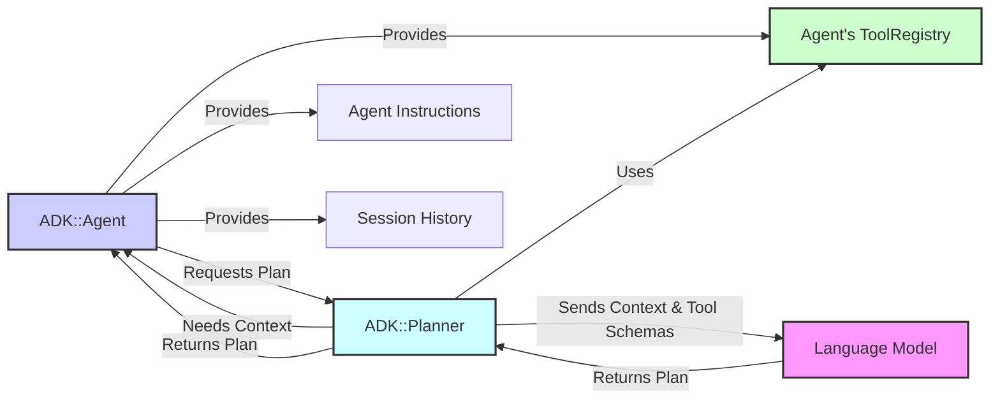

# ADK Planner

This document describes the role and function of the `ADK::Planner` within the ADK framework. The Planner is a key component responsible for determining the sequence of actions (tool calls) an agent should take to fulfill a user's request.

## 1. Purpose

When an agent receives a user task, it often needs a strategy to achieve the goal, especially if the task requires multiple steps or the use of tools. The `ADK::Planner`'s primary purpose is to:

*   Analyze the user's request in the context of the agent's instructions and conversation history.
*   Consider the tools available to the agent (provided via `ADK::ToolRegistry`).
*   Generate a step-by-step plan, usually consisting of tool calls with specific parameters.
*   Handle situations where planning might fail or need revision based on tool results.

ADK's default planner leverages a Language Model (LLM) to perform this reasoning and plan generation, making use of the descriptive metadata provided by each tool.

## 2. Interaction with Agent

The `ADK::Agent` delegates planning to the `Planner` during the `run_task` execution flow.

1.  The Agent calls a method like `planner.create_plan(...)`.
2.  The Agent provides the necessary context: its core `instruction` prompt, the current `session_history` (from the `SessionService`), and access to its `ToolRegistry`.
3.  The Planner retrieves the metadata (name, description, parameters) for all available tools from the `ToolRegistry`.
4.  The Planner constructs a prompt for the LLM, including the user request, agent instructions, conversation history, and the formatted list of available tools and their schemas.
5.  The LLM processes this prompt and generates a plan, typically formatted as a list of tool calls with arguments.
6.  The Planner parses the LLM's response into a structured plan object (e.g., an array of step hashes).
7.  The Planner returns this structured plan to the Agent.
8.  The Agent then proceeds to execute the steps in the plan.

## 3. Planning Process & LLM Interaction

The effectiveness of the planner heavily relies on the quality of the prompt sent to the LLM and the LLM's ability to reason and follow instructions.

*   **Tool Descriptions:** Clear and accurate `description` fields in your `ADK::Tool` metadata are crucial. The LLM uses these descriptions to understand when and how to use each tool.
*   **Parameter Schemas:** Well-defined `parameters` in the tool metadata allow the LLM to determine the necessary arguments for each tool call in the plan.
*   **Agent Instructions:** The agent's main `instruction` prompt sets the overall context and constraints for the LLM's planning process.
*   **History:** Providing conversation history allows the planner to consider previous interactions when creating the current plan.
*   **LLM Choice:** The specific LLM used (configured via the agent's `model_name`) significantly impacts planning capabilities.

## 4. Plan Structure

While the exact internal representation might vary, a plan generated by the `ADK::Planner` typically consists of a sequence of steps, where each step represents an action, most commonly a tool call. A step usually includes:

*   **`tool_name` (Symbol):** The name of the tool to execute.
*   **`parameters` (Hash):** The arguments to pass to the tool's `perform_execution` method.

## 5. Re-planning and Error Handling

Planning isn't always a single-shot process:

*   **Tool Errors:** If a tool execution fails during plan execution, the Agent might ask the `Planner` to revise the plan based on the error.
*   **Ambiguity:** If the initial plan is insufficient or based on incomplete information, the agent might engage in further interaction (possibly involving the planner again) to clarify before proceeding.
*   **No Plan:** If the LLM fails to generate a valid plan, the Planner communicates this back to the Agent, which then decides how to proceed based on its `fallback_mode`.

## 6. Configuration and Customization (Future)

Currently, the default planner's behavior is largely determined by the agent's configuration (instructions, tools, model). Future versions of ADK might introduce:

*   Explicit planner configuration options.
*   Support for different planning strategies or planner implementations beyond the default LLM-based approach.

## Further Reading

*   [`adk_architecture_overview`](./adk_architecture_overview)
*   [`adk_agent_lifecycle`](./adk_agent_lifecycle)
*   [`adk_tools_and_registry`](./adk_tools_and_registry)
