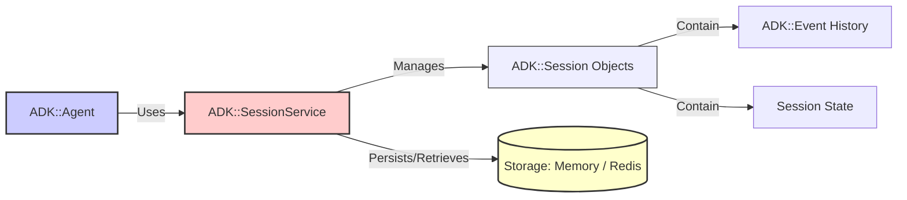

# ADK Session Service

This document explains the role and functionality of the Session Service within the ADK framework. The Session Service is responsible for managing the state and history of conversations between users and agents.

## 1. Purpose

Agents often need to maintain context over multiple turns of a conversation. This includes remembering:

*   Past user inputs.
*   Agent responses.
*   Tools called and their results.
*   Temporary state data relevant to the ongoing task.

The Session Service provides a persistent or in-memory store for this information, encapsulated within `ADK::Session` objects.

## 2. Architecture Overview



*   The `ADK::Agent` interacts with a configured `SessionService` implementation.
*   The `SessionService` is responsible for creating, retrieving, saving, and deleting `ADK::Session` instances.
*   Each `ADK::Session` holds the list of `ADK::Event`s constituting the conversation history and a key-value store for session-specific state.
*   The `SessionService` implementation dictates how Sessions are stored (e.g., in memory or in a Redis database).

## 3. Core Interface (`ADK::SessionService::Base`)

All session service implementations should adhere to the interface defined by `ADK::SessionService::Base` (though Ruby doesn't enforce interfaces strictly). Key methods include:

*   **`create_session(app_name:, user_id:, initial_state: {}) -> ADK::Session`**: Creates a new session instance with a unique ID.
*   **`get_session(session_id:) -> ADK::Session | nil`**: Retrieves an existing session by its ID. Returns `nil` if not found.
*   **`save_session(session:) -> Boolean`**: Persists the current state of the session object (including its events and state) to the underlying storage.
*   **`delete_session(session_id:) -> Boolean`**: Removes a session and its associated data from storage.
*   **`get_session_history(session_id:, limit: nil, offset: 0) -> Array<ADK::Event>`**: Retrieves the event history for a given session, optionally with pagination (`limit`, `offset`).
*   **`add_event_to_session(session_id:, event:) -> Boolean`**: Adds a new `ADK::Event` to the specified session's history and potentially updates its state based on `event.state_delta`. Also typically triggers a save.
*   **`load_scoped_state(prefix, key) -> Object | nil`**: Retrieves a value associated with a specific key within a given scope (`user`, `app`, `temp`). Only applicable for persistent stores like Redis.
*   **`save_scoped_state(prefix, key, value) -> Boolean`**: Saves a key-value pair within a specific scope.
*   **`clear_scoped_state(prefix, key) -> Boolean`**: Deletes a key (or all keys under a prefix if `key` is `'*'`) within a specific scope.

## 4. Implementations

ADK provides two primary implementations:

*   **`ADK::SessionService::InMemory`**: Stores all session data directly in the Ruby process's memory. 
    *   **Pros:** Simple, no external dependencies, fast for single-process applications.
    *   **Cons:** Data is lost when the process restarts. Not suitable for multi-process or distributed deployments. Scoped state methods (`load/save/clear_scoped_state`) have no effect as there is no shared persistent store.
*   **`ADK::SessionService::Redis`**: Stores session data (including events and state) in a Redis database.
    *   **Pros:** Persistent storage, suitable for multi-process/distributed deployments (e.g., web servers + Sidekiq workers), supports scoped state across sessions.
    *   **Cons:** Requires a running Redis server and configuration.
    *   **Storage Details:** Typically stores the main session object (metadata, state) under one key and the event list under another (e.g., using Redis Lists or Sorted Sets).

## 5. Configuration

You configure the session service implementation when setting up the ADK, typically within the `ADK.configure` block:

```ruby
require 'adk/session_service/redis'
require 'adk/session_service/in_memory'

ADK.configure do |config|
  # Option 1: Use Redis (Recommended for persistence)
  config.session_service = ADK::SessionService::Redis.new(
    # Optional: pass custom redis options or client instance
    # redis: Redis.new(url: ENV['MY_REDIS_URL'])
  )

  # Option 2: Use In-Memory (Simple, non-persistent)
  # config.session_service = ADK::SessionService::InMemory.new

  # Ensure Redis URL is configured if using RedisSessionService
  # config.redis_url = ENV.fetch('REDIS_URL', 'redis://localhost:6379/0')
end

# Access the configured instance later:
service = ADK.config.session_service
session = service.create_session(app_name: 'my_app', user_id: 'user123')
```

## 6. Interaction with `ADK::Agent`

The `ADK::Agent` relies heavily on the configured Session Service during `run_task`:

1.  It calls `get_session` (or `create_session` implicitly if needed) to load the session context.
2.  It passes the `session_service` instance within the `ADK::ToolContext` to tools, allowing them potential access.
3.  It uses `add_event_to_session` to record user input, tool requests, tool results, and agent responses, thus building the conversation history.
4.  The `ADK::Planner` typically receives the session history (retrieved via `get_session_history` by the agent) to inform its planning process.

## 7. Scoped State (`user:`, `app:`, `temp:`)

Beyond the temporary state stored directly within the `ADK::Session` object's `@state` (which is persisted with the session in Redis but only lives in memory for `InMemory`), the `RedisSessionService` supports *scoped state*. This allows storing key-value data that can potentially persist beyond a single session or be shared:

*   **`user:<key>`**: Data associated with a specific `user_id` across different sessions or applications.
*   **`app:<key>`**: Data associated with a specific `app_name` (agent application) across different users or sessions.
*   **`temp:<key>`**: Data intended to be temporary but potentially accessible outside the immediate session state (its exact persistence depends on service implementation, but often maps to session-specific Redis keys with expiry).

When using `set_state`, `get_state`, or `delete_state` with a key containing a valid prefix (e.g., `'user:preference'`), the `RedisSessionService` will interact with different Redis keys dedicated to that scope, rather than storing the data within the main session hash.

**Note:** The `InMemorySessionService` does not support scoped state; calls using prefixes will typically be ignored or might raise errors depending on the specific implementation details.

## 8. Serialization

For persistent storage (like Redis), `ADK::Session` and `ADK::Event` objects need to be serialized. They provide `to_h` methods to convert their state into Ruby Hashes suitable for JSON serialization. Correspondingly, they have `from_h` class methods to reconstruct objects from these Hash representations. The Session Service implementation handles this serialization/deserialization process when interacting with the storage layer.

(See `ADK::Session` and `ADK::Event` for details on their attributes and serializable format).

## Further Reading

*   [`adk_architecture_overview`](./adk_architecture_overview)
*   [`adk_agent_lifecycle`](./adk_agent_lifecycle) 