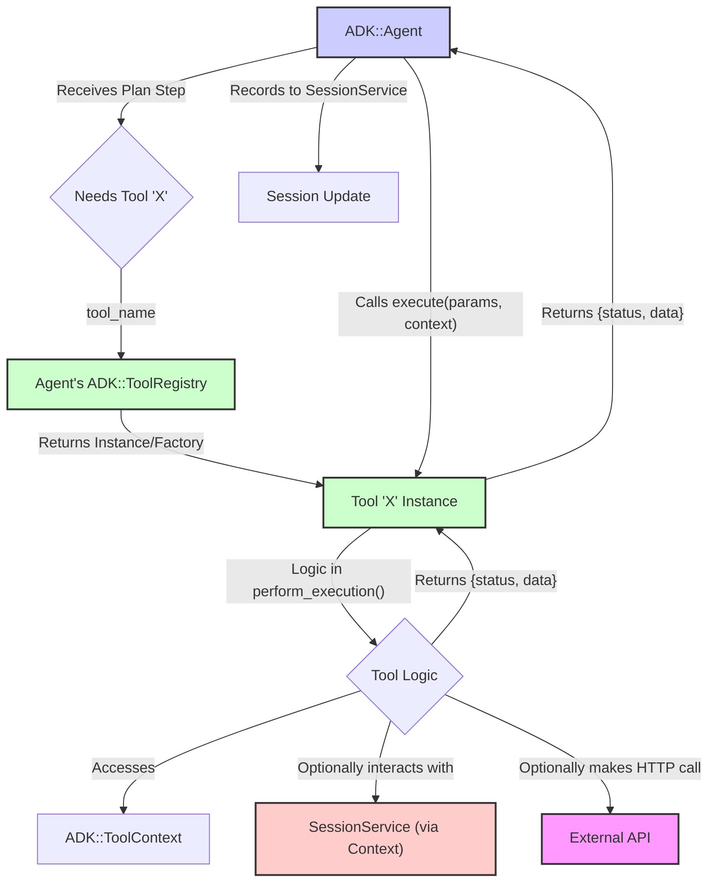

# ADK Tools and Registries

This document explains how tools are defined, managed, and executed within the ADK framework. Tools are fundamental building blocks that provide agents with specific capabilities to interact with the world or process information.

## 1. `ADK::Tool` - The Base for Capabilities

All tools in ADK inherit from the `ADK::Tool` base class. It defines the core interface and functionalities that every tool must provide.

### 1.1. Defining Tool Metadata (`define_metadata`)

Each tool class must declare its metadata using the `define_metadata` class method. This metadata is crucial for several reasons:

*   It allows the `ADK::Planner` (and the underlying LLM) to understand what the tool does and when to use it.
*   It defines the parameters the tool expects, including their types and whether they are required.
*   It provides a human-readable description.

Key metadata fields:

*   **`name` (Symbol):** A unique symbolic name for the tool (e.g., `:calculator`, `:web_search`).
*   **`description` (String):** A clear, concise description of the tool's purpose and functionality. This is heavily used by the LLM during planning.
*   **`parameters` (Hash):** A hash defining the input parameters the tool accepts. Each parameter is a key in this hash, and its value is another hash specifying:
    *   `type` (Symbol): The expected data type (e.g., `:string`, `:integer`, `:numeric`, `:boolean`, `:array`, `:hash`, `:object`).
    *   `required` (Boolean): Whether this parameter must be provided.
    *   `description` (String): A description of what this parameter represents.
    *   `default`: An optional default value if the parameter is not provided.
    *   `enum` (Array): An optional array of allowed values for the parameter.

**Example `define_metadata`:**

```ruby
class MySearchTool < ADK::Tool
  define_metadata(
    name: :my_custom_search,
    description: "Searches a specific internal knowledge base for articles matching the query.",
    parameters: {
      query: { type: :string, required: true, description: "The search term or question." },
      max_results: { type: :integer, required: false, default: 5, description: "Maximum number of results to return." },
      filter_by_date: { type: :boolean, required: false, default: false, description: "Whether to filter results by recent dates." }
    }
  )
  # ... perform_execution method ...
end
```

### 1.2. Implementing Tool Logic (`perform_execution`)

The core logic of a tool resides in its instance method `perform_execution(params, context)`.

*   **`params` (Hash):** A hash containing the actual parameter values provided for this tool call, as determined by the agent's plan. Keys are symbols.
*   **`context` (`ADK::ToolContext`):** An object providing contextual information and services to the tool during its execution (see section 2).

This method **must** return a status hash indicating the outcome:

*   **Success:** `{ status: :success, result: <payload> }`
    *   `<payload>`: The data or outcome of the tool's successful execution. This payload is recorded and can be used by the planner or agent for subsequent steps or generating a response.
*   **Error:** `{ status: :error, error_message: <String>, error_details: <Hash> (optional) }`
    *   `<String>`: A human-readable message describing the error.
    *   `<Hash>`: Optional additional structured data about the error.
    *   Alternatively, the tool can `raise ADK::ToolError` (or a subclass) for more structured error handling.
*   **Pending (for Asynchronous Tools):** `{ status: :pending, job_id: <String>, message: <String> (optional) }`
    *   Used by tools that initiate long-running background jobs.
    *   `<String>`: A unique identifier for the job.
    *   See `ADK::Tools::BaseAsyncJobTool` for more details.

**Example `perform_execution`:**

```ruby
  def perform_execution(params, context)
    query = params[:query]
    max_results = params.fetch(:max_results, 5) # Use default if not provided in plan

    # Simulate search logic
    ADK.logger.info("#{self.class.tool_name}: Searching for '#{query}' with max_results #{max_results}")
    results = ["Result 1 for #{query}", "Result 2 for #{query}"] # Dummy results

    if results.any?
      { status: :success, result: { articles: results, count: results.length } }
    else
      { status: :error, error_message: "No articles found for query: '#{query}'" }
    end
  rescue StandardError => e
    ADK.logger.error("#{self.class.tool_name}: Unexpected error: #{e.message}")
    { status: :error, error_message: "An unexpected error occurred during search: #{e.message}" }
  end
```

## 2. `ADK::ToolContext` - Information for Tools

When an agent executes a tool, it passes an `ADK::ToolContext` object to the `perform_execution` method. This object provides the tool with valuable contextual information and access to services:

*   **`session_id` (String):** The ID of the current agent session.
*   **`user_id` (String, optional):** An identifier for the user interacting with the agent.
*   **`app_name` (String, optional):** An identifier for the application or context in which the agent is running.
*   **`tool_registry` (`ADK::ToolRegistry`):** A reference to the agent's own tool registry. This could allow a tool to discover or even call other tools available to the agent (use with caution to avoid complex dependencies or loops).
*   **`session_service` (`ADK::SessionService` instance):** Allows the tool to directly interact with the session service, for example, to record specific events or retrieve other session data. This should be used judiciously, as the agent typically handles event recording.
*   **`logger` (`Logger`):** A logger instance for the tool to use.

Accessing this context allows tools to behave more intelligently or perform actions that depend on the broader conversational state or agent configuration.

## 3. Managing Tools: Registries

ADK uses a two-tiered system for managing tool availability:

### 3.1. `ADK::GlobalToolManager`

*   This is a **global, class-level registry** where `ADK::Tool` *classes* are registered.
*   When you define a tool class, you typically register it here using `ADK::GlobalToolManager.register(MyToolClass)`.
*   The ADK framework pre-registers its built-in tools (like `Calculator`, `EchoTool`, `WebhookTool`, etc.).
*   Its primary role is to make tool classes discoverable so they can be easily added to individual agent instances by name.

### 3.2. `ADK::ToolRegistry`

*   This is an **instance-specific registry** that belongs to each `ADK::Agent` instance.
*   It stores the actual tool *instances or factories* that a particular agent can use.
*   When an agent is initialized or started:
    *   If its definition includes `tool_classes`, instances of these classes are added to its `ToolRegistry`.
    *   If its definition includes a list of `tools` (by name), it looks up these tool classes in the `ADK::GlobalToolManager` and adds instances/factories to its `ToolRegistry`.
    *   Wrapped MCP tools (from `ADK::Mcp::ToolWrapper`) are also registered here.
*   The `ADK::Planner` interacts with an agent's `ToolRegistry` to get the metadata of available tools for planning.
*   When the agent needs to execute a tool step from a plan, it requests the tool instance from its `ToolRegistry` by name.

This separation allows different agents to have different sets of tools, even if those tools share common base classes registered globally.

## 4. Tool Execution Flow

The following diagram illustrates the typical flow when an agent decides to execute a tool:



## 5. Specialized Tool Types

ADK provides base classes or modules for common tool patterns:

*   **`ADK::Tools::BaseAsyncJobTool`**: A base class for tools that initiate long-running background jobs (typically using Sidekiq). It handles returning a `:pending` status and a `job_id`. Requires a companion tool, `ADK::Tools::CheckJobStatusTool`, for clients or agents to poll for the job's completion.
*   **`ADK::Tools::Base::HttpClient`**: A module that can be included in any custom tool to provide convenient methods for making HTTP requests (`http_get`, `http_post`, etc.), with built-in support for configurable base URLs, headers, and timeouts. (See `public/docs/http_client_usage.md`).
*   **`ADK::Tools::WebhookTool`**: A pre-built tool for sending simple outbound POST webhooks, often with JSON payloads and optional HMAC signing. (See `public/docs/sending_outbound_webhooks.md`).
*   **`ADK::Tools::AgentTool`**: A special tool that allows one agent to invoke another agent as if it were a tool. This enables more complex, hierarchical agent structures.

## 6. Creating Custom Tools

Developing custom tools is a primary way to extend ADK's capabilities:

1.  Create a new class that inherits from `ADK::Tool` (or a more specialized base like `BaseAsyncJobTool`).
2.  Use `define_metadata` to describe your tool's name, purpose, and parameters.
3.  Implement the `perform_execution(params, context)` method with your tool's logic.
4.  Ensure `perform_execution` returns a valid status hash (`:success`, `:error`, or `:pending`).
5.  Register your tool class with `ADK::GlobalToolManager.register(YourCustomToolClass)` in an initializer or before agents that need it are defined.
6.  Add the tool's name (symbol) to the `:tools` array in your agent's definition, or its class to `tool_classes` if defining programmatically.

## Further Reading

*   [`adk_architecture_overview.md`](./adk_architecture_overview.md)
*   [`adk_agent_lifecycle.md`](./adk_agent_lifecycle.md) 