# Legate Callbacks: Observe, Customize, and Control Agent Behavior

## Introduction: What are Callbacks and Why Use Them?

Callbacks are a cornerstone feature of the Ruby Legate, providing a powerful mechanism to hook into an agent's execution process. They allow you to observe, customize, and even control the agent's behavior at specific, predefined points without modifying the core Legate framework code.

**What are they?** In essence, callbacks are standard Ruby Procs or lambdas that you define. You then associate these functions with an agent when you create its `Legate::AgentDefinition`. The Legate framework automatically calls your functions at key stages, letting you observe or intervene. Think of it like checkpoints during the agent's process:

*   **Agent Lifecycle:**
    *   `before_agent_callback`: Executes right before the agent's main work begins for a specific `run_task` request.
    *   `after_agent_callback`: Executes right after the agent has finished all its steps for that request and has prepared the final result, but just before the result is returned from `run_task`.
*   **Model Interaction (LLM):**
    *   `before_model_callback`: Runs just before a request is made to the Large Language Model (LLM) by the `Legate::Planner`.
    *   `after_model_callback`: Runs immediately after a response is received from the LLM by the `Legate::Planner`.
*   **Tool Execution:**
    *   `before_tool_callback`: Called just before a specific tool's `execute` method is invoked by the agent.
    *   `after_tool_callback`: Called immediately after a tool's `execute` method successfully completes (before its result is further processed by the agent).

**Why use them?** Callbacks unlock significant flexibility and enable advanced agent capabilities:

*   **Observe & Debug:** Log detailed information at critical steps for monitoring and troubleshooting.
*   **Customize & Control:** Modify data flowing through the agent (like LLM requests or tool results) or even bypass certain steps entirely based on your logic.
*   **Implement Guardrails:** Enforce safety rules, validate inputs/outputs, or prevent disallowed operations.
*   **Manage State:** Read or dynamically update the agent's session state during execution via the provided context object.
*   **Integrate & Enhance:** Trigger external actions (API calls, notifications) or add features like caching.

**How are they added?** You register callbacks by assigning Procs to the relevant attributes in the `Legate::AgentDefinition` block:

```ruby
# --- Define your callback function ---
my_before_model_callback_proc = lambda do |callback_context, llm_request_params|
  # callback_context is an instance of Legate::Callbacks::CallbackContext
  # llm_request_params is a Hash representing what would be sent to the LLM
  puts "[Callback] Before model call for agent: #{callback_context.agent_name}"
  # ... your custom logic here ...

  # Example: Modify the request
  llm_request_params[:prompt] = "Prefix: " + llm_request_params[:prompt]

  return nil # Allow the model call to proceed with (potentially modified) request
end

# --- Register it during AgentDefinition ---
Legate::Agent.define do |a|
  a.name :my_callback_agent
  a.model_name "gemini-2.0-flash"
  a.instruction "Be helpful."
  # ... other agent parameters ...

  a.before_model_callback(&my_before_model_callback_proc)
end
```

## The Callback Mechanism: Interception and Control

When the Legate framework encounters a point where a callback can run (e.g., just before calling the LLM), it checks if you provided a corresponding callback Proc for that agent. If you did, the framework executes your Proc.

**Context is Key:** Your callback Proc isn't called in isolation. The framework provides special context objects (`Legate::Callbacks::CallbackContext` or `Legate::ToolContext`) as arguments. These objects contain vital information about the current state of the agent's execution, including the invocation details, session state, and access to services like the session service and logger.

**Controlling the Flow (The Core Mechanism):** The most powerful aspect of callbacks lies in how their return value influences the agent's subsequent actions.

*   **`return nil` (or last expression evaluates to `nil`): Allow Default Behavior**
    *   This is the standard way to signal that your callback has finished its work (e.g., logging, inspection, minor modifications to mutable input arguments) and that the Legate agent should proceed with its normal operation.
    *   For `before_*` callbacks, returning `nil` means the next step in the sequence (running the agent logic, calling the LLM, executing the tool) will occur.
    *   For `after_*` callbacks, returning `nil` means the result just produced by the preceding step (the agent's output, the LLM's response, the tool's result) will be used as is.

*   **`return <Specific Object>` (Override Default Behavior / Replace Result):**
    *   Returning a specific type of object (instead of `nil`) is how you override the Legate agent's default behavior or replace a result.
    *   **`before_agent_callback` &rarr; `Hash` (Agent Content):** Skips the agent's main `run_task` logic. The returned Hash is treated as the agent's final output content for this turn.
    *   **`before_model_callback` &rarr; `Hash` (Planner Plan):** Skips the call to the external Large Language Model by the `Legate::Planner`. The returned Hash (expected plan structure) is used as if it were the response from the LLM.
    *   **`before_tool_callback` &rarr; `Hash` (Tool Result):** Skips the execution of the actual tool's `execute` method. The returned Hash (standard tool result format, e.g., `{status: :success, result: ...}`) is used as the result of the tool call.
    *   **`after_agent_callback` &rarr; `Hash` (Agent Content):** Replaces the content Hash that the agent's `run_task` logic just produced.
    *   **`after_model_callback` &rarr; `Hash` (Planner Plan):** Replaces the plan Hash received from the LLM.
    *   **`after_tool_callback` &rarr; `Hash` (Tool Result):** Replaces the result Hash returned by the tool's `execute` method.

**State Management in Callbacks:**
Callbacks can read from and write to the session state using methods on the `callback_context` (an instance of `Legate::Callbacks::CallbackContext`) or `tool_context` (an instance of `Legate::ToolContext`). Key methods include:
*   `state_get(key)`: Retrieves a value from the session state.
*   `state_set(key, value)`: Sets a value in the pending state delta.
*   `state_update(hash_to_merge)`: Merges a hash of key-value pairs into the pending state delta.

Changes made via `state_set` or `state_update` are collected in a `pending_state_delta` within the context object.
The Legate framework automatically merges this `pending_state_delta` into the `state_delta` of the *next relevant Legate::Event* that is logged to the session history. This ensures state changes are tied to specific points in the execution flow.

## Types of Callbacks

### 1. Agent Lifecycle Callbacks (`Legate::Agent`)

These callbacks hook into the overall execution of an agent's `run_task` method.

#### `before_agent_callback`

*   **When:** Called immediately *before* the agent's main `run_task` logic begins (after session retrieval but before planning or tool execution for that task).
*   **Signature:** `lambda { |callback_context| ... }`
    *   `callback_context` (`Legate::Callbacks::CallbackContext`): Provides agent name, invocation ID, session details, session service, logger, and state access methods.
*   **Purpose:**
    *   Initial setup or validation for a specific task run.
    *   Logging entry into the agent's task processing.
    *   Access control: Decide if the agent should even process the current request.
    *   Modifying initial session state for the current invocation via `callback_context.state_set`.
*   **Return Value Effect:**
    *   `nil`: Agent proceeds with its normal `run_task` logic (planning, execution).
    *   `Hash` (Agent Content, e.g., `{status: :success, result: "Handled by callback"}`): Agent's main logic for `run_task` is skipped. The returned Hash becomes the content of the final agent event for this turn.

```ruby
# Example: before_agent_callback
Legate::Agent.define do |a|
  a.name :my_guarded_agent
  # ...
  a.before_agent_callback do |context|
    if context.state_get(:user_flagged)
      puts "[Callback] User #{context.user_id} is flagged. Skipping agent run."
      context.state_set(:agent_skipped_reason, "User flagged")
      { status: :error, error_message: "Access denied for this request." } # Override
    else
      puts "[Callback] User #{context.user_id} is not flagged. Proceeding."
      nil # Proceed
    end
  end
end
```

#### `after_agent_callback`

*   **When:** Called *after* the agent's `run_task` logic has fully completed and generated its final response content, but *before* that final `Legate::Event` is returned from `run_task`.
*   **Signature:** `lambda { |callback_context, agent_response_content| ... }`
    *   `callback_context` (`Legate::Callbacks::CallbackContext`)
    *   `agent_response_content` (`Hash`): A mutable copy of the content hash that the agent is about to return (e.g., `{status: :success, result: ..., plan_details: ...}`).
*   **Purpose:**
    *   Post-processing the agent's final response.
    *   Logging the outcome of the agent's task.
    *   Final state modifications based on the agent's overall result.
    *   Adding standard disclaimers or formatting to all agent outputs.
*   **Return Value Effect:**
    *   `nil`: The `agent_response_content` (potentially modified in place by the callback) is used as the final agent event content.
    *   `Hash` (Agent Content): The returned Hash *replaces* the agent's original `agent_response_content`.

```ruby
# Example: after_agent_callback
Legate::Agent.define do |a|
  a.name :my_response_modifier_agent
  # ...
  a.after_agent_callback do |context, response_content|
    puts "[Callback] Agent finished. Original response content: #{response_content.inspect}"
    if response_content[:status] == :success
      response_content[:result] = "[MODIFIED] #{response_content[:result]}"
      context.state_set(:last_response_modified, true)
    end
    # If you return nil, the (modified) response_content is used.
    # Or, you could return a completely new Hash:
    # { status: :success, result: "New result from callback", original_was: response_content }
    nil
  end
end
```

### 2. Model Interaction Callbacks (`Legate::Planner` via `Legate::Agent`)

These callbacks hook into the `Legate::Planner`'s interaction with the LLM. The `Legate::Agent` orchestrates these callbacks around its call to the planner.

#### `before_model_callback`

*   **When:** Called just *before* the `Legate::Planner` makes a request to the LLM (e.g., to generate a plan).
*   **Signature:** `lambda { |callback_context, llm_request_params| ... }`
    *   `callback_context` (`Legate::Callbacks::CallbackContext`): Provides agent/session context.
    *   `llm_request_params` (`Hash`): A mutable hash representing the parameters that will be sent to the LLM (e.g., `{ prompt: "...", model_config: {...} }`). Modifications to this hash will affect the actual LLM call.
*   **Purpose:**
    *   Inspect or modify the prompt/request being sent to the LLM.
    *   Implement input guardrails (e.g., block certain prompts).
    *   Inject dynamic information into the prompt from session state.
    *   Implement request-level caching (return a cached plan).
*   **Return Value Effect:**
    *   `nil`: The planner proceeds to call the LLM with the (potentially modified) `llm_request_params`.
    *   `Hash` (Planner Plan, e.g., `{ steps: [...] }` or `{ error: "..." }`): The planner skips the actual LLM call and uses this returned Hash as if it were the LLM's response.

```ruby
# Example: before_model_callback
Legate::Agent.define do |a|
  a.name :my_prompt_injector_agent
  # ...
  a.before_model_callback do |context, request_params|
    user_preference = context.state_get(:user_style_preference)
    if user_preference
      request_params[:prompt] += "\nStyle hint: #{user_preference}"
    end
    
    if request_params[:prompt].include?("forbidden topic")
      puts "[Callback] Forbidden topic detected in prompt. Blocking LLM call."
      { error: "Request blocked due to content policy." } # Override
    else
      nil # Proceed
    end
  end
end
```

#### `after_model_callback`

*   **When:** Called *after* the `Legate::Planner` receives a response from the LLM, but *before* the planner fully processes this response into its internal plan structure.
*   **Signature:** `lambda { |callback_context, llm_response_data| ... }`
    *   `callback_context` (`Legate::Callbacks::CallbackContext`)
    *   `llm_response_data` (`Hash`): A mutable copy of the raw-ish response data from the LLM (e.g., the parsed JSON string that the planner will then interpret into steps).
*   **Purpose:**
    *   Inspect or modify the LLM's raw response.
    *   Sanitize LLM output.
    *   Log LLM responses for analysis or fine-tuning.
    *   Parse structured data from the LLM output and store it in session state.
*   **Return Value Effect:**
    *   `nil`: The (potentially modified in place) `llm_response_data` is used by the planner.
    *   `Hash` (Planner Plan): The returned Hash *replaces* the LLM's original response.

```ruby
# Example: after_model_callback
Legate::Agent.define do |a|
  a.name :my_llm_response_logger_agent
  # ...
  a.after_model_callback do |context, llm_response|
    puts "[Callback] LLM Response received: #{llm_response.inspect}"
    context.state_set(:last_llm_raw_output, llm_response)

    if llm_response.is_a?(Hash) && llm_response.dig(:plan, 0, :tool_name) == :risky_tool
      puts "[Callback] LLM planned risky_tool. Modifying plan to use safe_tool instead."
      llm_response[:plan][:tool_name] = :safe_tool # Modify in place
    end
    nil # Use the (potentially modified) llm_response
  end
end
```

### 3. Tool Execution Callbacks (`Legate::Agent`)

These callbacks hook into the agent's execution of individual tools.

#### `before_tool_callback`

*   **When:** Called *before* a specific tool's `execute` method is invoked by the agent.
*   **Signature:** `lambda { |tool_instance, tool_args, tool_context| ... }`
    *   `tool_instance` (`Legate::Tool`): The instance of the tool about to be executed.
    *   `tool_args` (`Hash`): A mutable hash of the arguments that will be passed to the tool.
    *   `tool_context` (`Legate::ToolContext`): Context specific to this tool execution, providing session details, access to the agent's tool registry, session service, logger, invocation ID, and state methods.
*   **Purpose:**
    *   Inspect or modify tool arguments before execution.
    *   Implement tool-specific input validation or authorization.
    *   Log tool usage attempts.
    *   Implement tool-level caching (return a cached result).
*   **Return Value Effect:**
    *   `nil`: The tool's `execute` method is called with the (potentially modified) `tool_args`.
    *   `Hash` (Tool Result, e.g. `{status: :success, result: ...}`): The tool's `execute` method is skipped. The returned Hash is used as the result of the tool call.

```ruby
# Example: before_tool_callback
Legate::Agent.define do |a|
  a.name :my_tool_caching_agent
  # ...
  a.before_tool_callback do |tool, args, context|
    if tool.name == :expensive_api_call
      cache_key = "cache:#{tool.name}:#{args.to_json}"
      cached_result = context.state_get(cache_key)
      if cached_result
        puts "[Callback] Cache hit for #{tool.name}! Returning cached result."
        return cached_result # Override: return cached result
      end
    end
    args[:timestamp] = Time.now.iso8601 # Modify args
    nil # Proceed with actual tool call
  end
end
```

#### `after_tool_callback`

*   **When:** Called *after* a tool's `execute` method successfully completes and returns its result hash, but *before* this result is further processed or logged by the agent. It does *not* run if the tool's `execute` method itself raised an unhandled exception.
*   **Signature:** `lambda { |tool_instance, tool_args, tool_context, tool_result| ... }`
    *   `tool_instance` (`Legate::Tool`)
    *   `tool_args` (`Hash`): The (potentially modified by `before_tool_callback`) arguments that were passed to the tool.
    *   `tool_context` (`Legate::ToolContext`)
    *   `tool_result` (`Hash`): A mutable copy of the result hash returned by the tool's `execute` method.
*   **Purpose:**
    *   Inspect or modify the tool's result.
    *   Log tool execution outcomes.
    *   Post-process or format tool results.
    *   Save tool results to a cache or session state.
*   **Return Value Effect:**
    *   `nil`: The (potentially modified in place) `tool_result` is used by the agent.
    *   `Hash` (Tool Result): The returned Hash *replaces* the tool's original `tool_result`.

```ruby
# Example: after_tool_callback
Legate::Agent.define do |a|
  a.name :my_tool_result_processor_agent
  # ...
  a.after_tool_callback do |tool, args, context, result|
    puts "[Callback] Tool #{tool.name} executed with #{args.inspect}. Result: #{result.inspect}"
    if tool.name == :expensive_api_call && result[:status] == :success
      cache_key = "cache:#{tool.name}:#{args.to_json}"
      context.state_set(cache_key, result.dup) # Save a copy to state for caching
      puts "[Callback] Saved result for #{tool.name} to cache."
    end

    if result[:status] == :success && result[:result].is_a?(String)
      result[:result] = result[:result].upcase # Modify result in place
    end
    nil # Use the modified result
  end
end
```

## Design Patterns and Best Practices for Callbacks

By understanding this callback mechanism, you can precisely control the agent's execution path, making callbacks an essential tool for building sophisticated and reliable agents with the Ruby Legate.

Callbacks are versatile. Here are some common patterns and best practices to make the most of them in your Legate agents:

### 1. Comprehensive Logging and Auditing

Use callbacks to gain deep insights into your agent's behavior by logging detailed information at each step.

*   **`before_agent_callback`**: Log the initial request and any relevant session state.
*   **`before_model_callback`**: Log the exact prompt being sent to the LLM.
*   **`after_model_callback`**: Log the raw response from the LLM.
*   **`before_tool_callback`**: Log the tool name and arguments before execution.
*   **`after_tool_callback`**: Log the result (or error) from a tool.
*   **`after_agent_callback`**: Log the final response being sent to the user and any significant state changes.

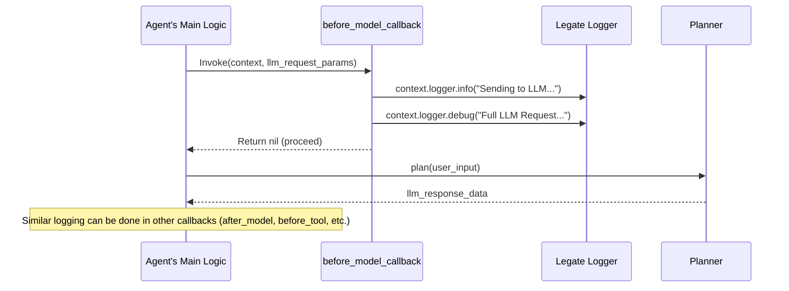

**Code Example:**
```ruby
# Example: Detailed Logging
Legate::Agent.define do |a|
  a.name :audit_trail_agent
  a.instruction "I am an agent that logs everything."
  a.model_name "gemini-pro" # Or your preferred model

  a.before_agent_callback do |context|
    context.logger.info "[Audit] Agent '#{context.agent_name}' starting task. Invocation: #{context.invocation_id}, Session: #{context.session_id}"
    # Log initial important state if any
    important_state = context.state_get(:user_preference)
    context.logger.debug "[Audit] Initial user_preference: #{important_state}" if important_state
    nil
  end

  a.before_model_callback do |context, llm_request_params|
    context.logger.info "[Audit] Sending to LLM. Prompt snippet: #{llm_request_params[:prompt][0..100]}..."
    context.logger.debug "[Audit] Full LLM Request: #{llm_request_params.inspect}"
    nil
  end

  # ... (other logging callbacks as shown previously) ...
end
```

### 2. Input Validation and Sanitization (Guardrails)

Ensure data integrity and enforce policies by validating inputs and sanitizing outputs.

*   **`before_model_callback`**: Check the prompt for policy violations. Return an error plan to prevent the LLM call, or sanitize the prompt.

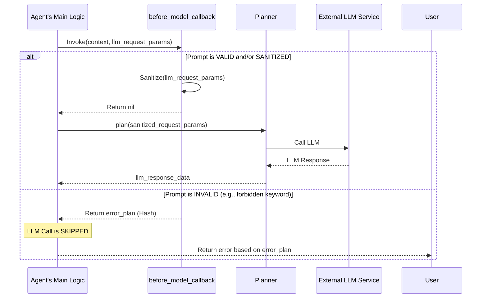

**Code Example:**
```ruby
# Example: Input Guardrails
Legate::Agent.define do |a|
  a.name :safe_query_agent
  a.instruction "I will only process safe queries."
  a.model_name "gemini-pro"

  FORBIDDEN_KEYWORDS = [/unsafe_action/i, /dangerous_command/i].freeze

  a.before_model_callback do |context, llm_request_params|
    prompt_text = llm_request_params[:prompt]
    if FORBIDDEN_KEYWORDS.any? { |keyword| prompt_text.match?(keyword) }
      context.logger.warn "[Guardrail] Forbidden keyword detected. Blocking LLM call."
      { error: "Request blocked due to content policy." } # Override
    else
      llm_request_params[:prompt] = prompt_text.gsub(/email:\s*\S+@\S+\.\S+/, "email: [REDACTED]")
      nil # Proceed
    end
  end
  # ... (other guardrail callbacks as shown previously) ...
end
```

### 3. Caching Strategies

Improve performance and reduce costs by caching results from LLM calls or expensive tool executions.

*   **`before_model_callback`**: Check cache. If hit, return cached plan.
*   **`after_model_callback`**: If cache miss, store LLM response in cache.

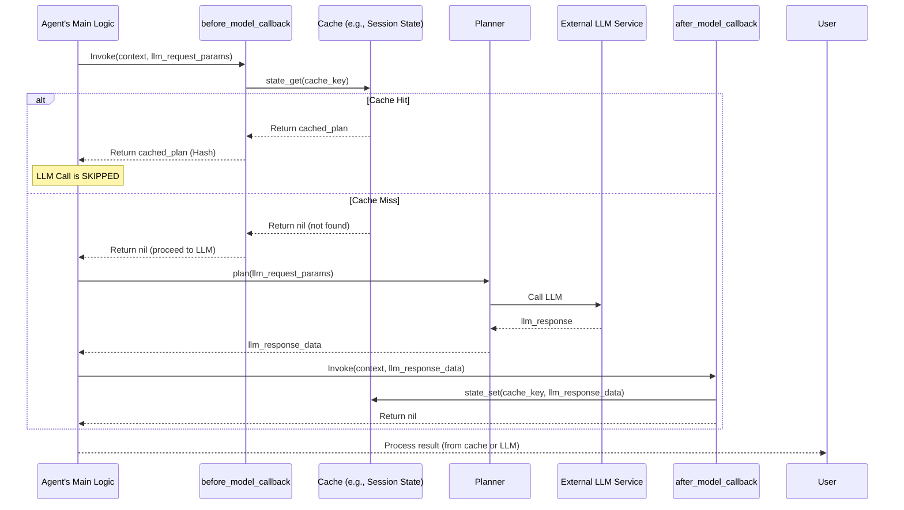

**Code Example:**
```ruby
# Example: Caching LLM Responses (Simplified)
require 'digest'
Legate::Agent.define do |a|
  a.name :caching_agent
  a.instruction "I try to be efficient by caching."
  a.model_name "gemini-pro"

  a.before_model_callback do |context, llm_request_params|
    cache_key = "llm_cache:#{Digest::SHA256.hexdigest(llm_request_params[:prompt])}"
    cached_plan = context.state_get(cache_key)
    if cached_plan
      context.logger.info "[Cache] LLM cache hit."
      return cached_plan # Override
    else
      context.logger.info "[Cache] LLM cache miss."
      context.instance_variable_set(:@current_cache_key, cache_key) # Store for after_model_callback
      nil # Proceed
    end
  end

  a.after_model_callback do |context, llm_response_data|
    cache_key = context.instance_variable_get(:@current_cache_key)
    if cache_key && llm_response_data.is_a?(Hash) && llm_response_data.key?(:steps)
      context.state_set(cache_key, llm_response_data.dup)
      context.logger.info "[Cache] Stored LLM response in cache."
    end
    nil
  end
end
```
*Note: Robust caching requires careful key generation and consideration of cache eviction policies.*

### 4. Dynamic Prompt Engineering

Modify prompts on the fly based on session state, user history, or other dynamic factors.

*   **`before_model_callback`**: Inject dynamic information into the prompt.

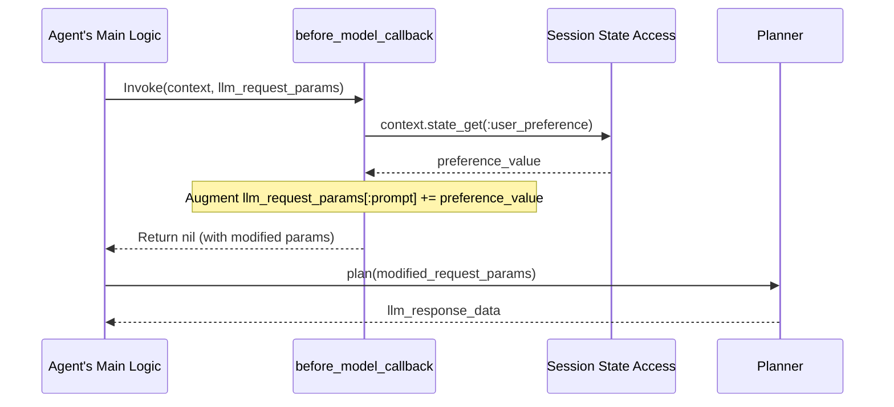

**Code Example:**
```ruby
# Example: Dynamic Prompt Injection
Legate::Agent.define do |a|
  a.name :personalized_agent
  a.instruction "I tailor my responses." # Base instruction
  a.model_name "gemini-pro"

  a.before_model_callback do |context, llm_request_params|
    user_tone = context.state_get(:user_tone)
    if user_tone && llm_request_params[:prompt].is_a?(String)
      llm_request_params[:prompt] += "\n\nPlease respond in a #{user_tone} tone."
      context.logger.info "[Personalize] Augmented prompt with tone."
    end
    nil
  end
end
```

### 5. Conditional Execution & Overrides

Control the agent's workflow by conditionally skipping steps or providing alternative results.

*   **`before_model_callback`**: If query matches FAQ, return a pre-canned plan.

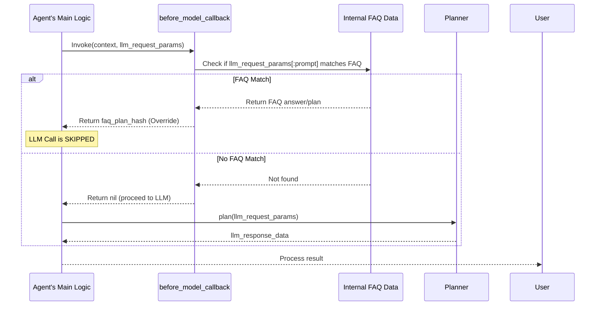

**Code Example:**
```ruby
# Example: Conditional Skip of LLM for FAQ
Legate::Agent.define do |a|
  a.name :faq_bot
  a.instruction "I answer FAQs."
  a.model_name "gemini-pro"

  FAQ = { "what is your name?" => "My name is FAQ Bot." }.freeze

  a.before_model_callback do |context, llm_request_params|
    query = llm_request_params[:prompt].to_s.downcase.strip
    if FAQ.key?(query)
      context.logger.info "[FAQ] Matched FAQ."
      { thought_process: "FAQ match.", steps: [{ type: :agent_response, tool_name: :echo, tool_input: { message: FAQ[query] } }] } # Override
    else
      nil # Proceed to LLM
    end
  end
end
```

### 6. Advanced State Management Techniques

Use callbacks to manage complex state transitions or share information.

*   **`after_tool_callback`**: Parse complex tool result and store structured data into session state.

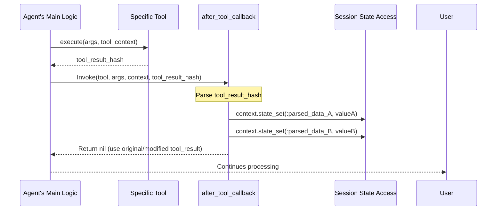

**Code Example:**
```ruby
# Example: Storing Parsed Tool Output
require 'json'
Legate::Agent.define do |a|
  a.name :data_parser_agent
  a.use_tool :fetch_user_profile # Assumed to return JSON string

  a.after_tool_callback do |tool, _args, context, tool_result|
    if tool.name == :fetch_user_profile && tool_result[:status] == :success
      begin
        data = JSON.parse(tool_result[:result])
        context.state_set(:user_name_from_profile, data['name'])
        context.state_set(:user_email_from_profile, data['email'])
        context.logger.info "[State] Parsed and stored profile data."
      rescue JSON::ParserError => e
        context.logger.error "[State] Failed to parse profile JSON: #{e.message}"
      end
    end
    nil
  end
end
```

### 7. Integrating External Services

Trigger external API calls or notifications at appropriate points.

*   **`after_agent_callback`**: Send a notification with the task outcome.

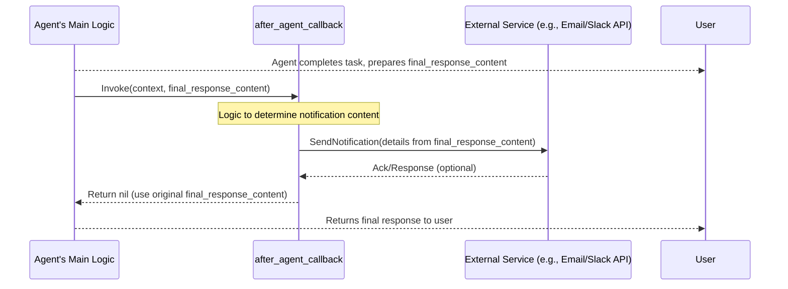

**Code Example:**
```ruby
# Example: Notification on Task Completion (Conceptual)
# Assume NotificationService.send(...) exists
Legate::Agent.define do |a|
  a.name :notifier_agent
  # ...
  a.after_agent_callback do |context, agent_response_content|
    subject = if agent_response_content[:status] == :error
                "Agent Task Failed: #{context.agent_name}"
              else
                "Agent Task Completed: #{context.agent_name}"
              end
    # Conceptual call
    # NotificationService.send(to: 'ops@example.com', subject: subject, body: agent_response_content.inspect)
    context.logger.info "[Notification] Would send notification: #{subject}"
    nil
  end
end
```

By combining these patterns, you can build highly customized, robust, and observable agents using the Legate callback system. Remember to keep callbacks focused on their specific stage and to handle errors gracefully within your callback logic.

## Callbacks: Visualizing the Flow

This section provides Mermaid sequence diagrams to visualize how different callbacks intercept and potentially alter the typical execution flow of an Legate Agent interacting with an LLM (via its Planner).

### Scenario 1: `before_agent_callback` Skips Agent Execution

This diagram shows a `before_agent_callback` determining that the agent's main logic should be skipped, and the callback itself provides the final response.

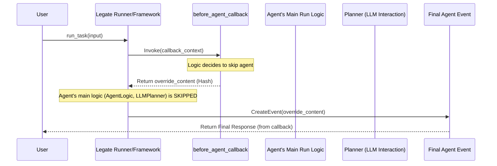

**Explanation:**

1.  The `User` initiates a task.
2.  The `Legate Runner/Framework` calls the `before_agent_callback`.
3.  The callback's internal logic decides the main agent execution isn't needed (e.g., access denied, simple known answer).
4.  It returns an `override_content` (a Hash representing the agent's response).
5.  The framework bypasses the `Agent's Main Run Logic` and any calls to the `Planner (LLM Interaction)`.
6.  A `Final Agent Event` is created directly from the callback's `override_content` and returned to the `User`.

---

### Scenario 2: `before_model_callback` Skips LLM Call (e.g., Cache Hit)

Here, the `before_model_callback` intercepts the request to the LLM, finds a cached response, and returns it, preventing the actual LLM call.

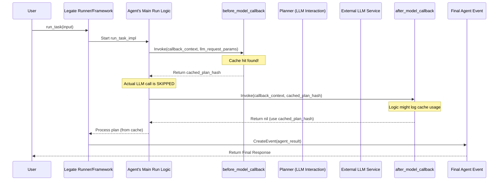

**Explanation:**

1.  The agent's main logic decides it needs to consult the LLM.
2.  Before calling the `LLMPlanner` (which would call the `External LLM Service`), the `before_model_callback` is invoked.
3.  The callback finds a suitable pre-existing plan/response (e.g., from a cache).
4.  It returns this `cached_plan_hash`.
5.  The `AgentLogic` uses this cached plan, skipping the call to the `LLMPlanner` and the `External LLM Service`.
6.  The `after_model_callback` is still called with the `cached_plan_hash`. It might log that a cache was used or perform other actions, then returns `nil` to indicate the cached plan should be used.
7.  The agent proceeds with the cached plan.

---

### Scenario 3: `after_model_callback` Modifies LLM Response

This diagram shows the `after_model_callback` inspecting and altering the response received from the LLM before the agent uses it.

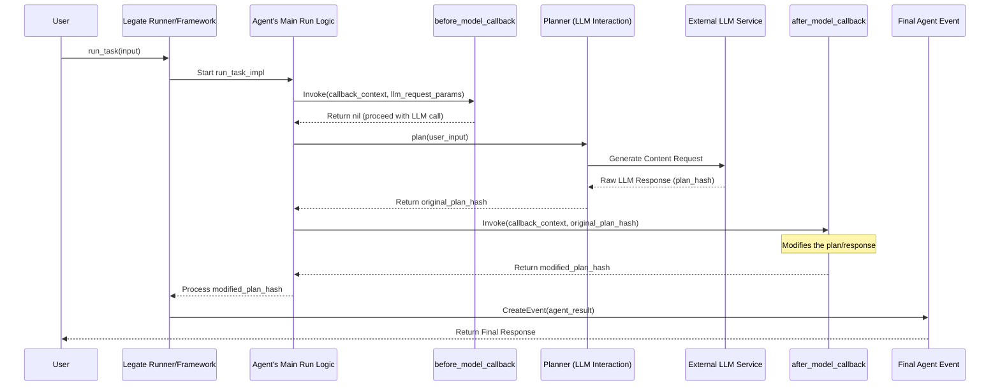

**Explanation:**

1.  The `before_model_callback` allows the LLM call to proceed (returns `nil`).
2.  The `LLMPlanner` calls the `External LLM Service` and gets a response (e.g., a plan).
3.  The `AgentLogic` receives this `original_plan_hash`.
4.  The `after_model_callback` is invoked with the `original_plan_hash`.
5.  The callback modifies the plan (e.g., adds a disclaimer, filters content, changes a tool call).
6.  It returns the `modified_plan_hash`.
7.  The `AgentLogic` uses this `modified_plan_hash` for subsequent steps.

---

### Scenario 4: Tool Callbacks with `before_tool_callback` Skipping Execution

This shows a `before_tool_callback` preventing a tool from actually running, perhaps due to invalid arguments or a cache hit.

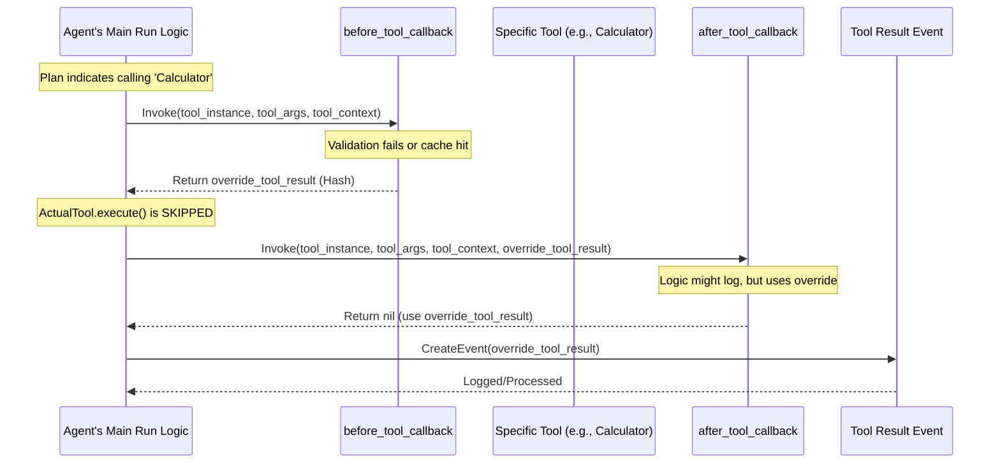

**Explanation:**

1.  The `AgentLogic` determines it needs to call a specific tool (e.g., "Calculator").
2.  The `before_tool_callback` is invoked with the tool instance, arguments, and context.
3.  The callback decides the tool shouldn't run (e.g., arguments are invalid, or it has a cached result).
4.  It returns an `override_tool_result` (a Hash in the standard tool result format).
5.  The `ActualTool.execute()` method is **not** called.
6.  The `after_tool_callback` is still invoked, but it receives the `override_tool_result`. It might log this or perform other actions, then likely returns `nil` to indicate the override should be used.
7.  The `AgentLogic` processes the `override_tool_result` as if it came from the actual tool.

---

This documentation should provide a solid starting point for users to understand and leverage the callback system you're planning. Remember to update the conceptual `CallbackContext` and `ToolContext` definitions in the examples once their final Ruby implementation is in place.