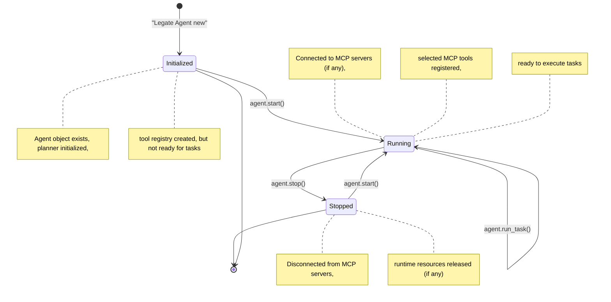

# Legate Agent Lifecycle

This document describes the lifecycle of an `Legate::Agent` instance, from its creation and initialization through starting, task execution, and stopping.

## Lifecycle States & Transitions

The following diagram illustrates the primary states of an agent instance and the methods or events that cause transitions between these states:



## Quick path: `Agent#ask`

For the common "just answer this" case you don't need to drive the lifecycle by
hand. `Agent#ask` lazily starts the agent, creates (or reuses) a session on the
agent's own session service, runs the task, and returns the final event:

```ruby
agent = Legate::Agent.new(definition: my_definition)

puts agent.ask('What is 2 + 2?').answer          # => "4"
agent.ask('Search for ruby') { |event| ... }      # optional block streams progress (see Streaming guide)
agent.ask('Follow-up', session_id: existing_id)   # continue a conversation
```

The returned `Legate::Event` exposes `#answer`, `#success?`, `#error?`, and
`#error_message`, so you rarely reach into `event.content` directly. `ask` does
**not** auto-stop (stopping tears down MCP connections that are costly to
re-establish); call `#stop` when done, or let process exit reclaim it.

The phases below describe the explicit lifecycle `ask` automates — reach for them
when you need fine control (long-lived hosts, custom session management, the
workflow agent types).

## Lifecycle Phases

### 1. Initialization (`Legate::Agent.new`)

*   **Trigger:** Calling `Legate::Agent.new(definition:, session_service: nil, planner_override: nil, sub_agents: nil)` where `definition` is an instance of `Legate::AgentDefinition`. This definition object would have been created programmatically (e.g., `Legate::AgentDefinition.new.define { ... }`) or loaded and deserialized (e.g., from a store, often involving `Legate::AgentDefinition.from_hash(hash_from_store)` if the store provides hashes). Optional parameters allow injecting a custom `session_service`, a `planner_override`, or pre-initialized `sub_agents`.
*   **State:** Enters the **Initialized** state.
*   **Actions:**
    *   The `Legate::AgentDefinition` object provides all core static properties: `name`, `description`, `instruction`, `tool_names` (symbols of tools to use), `model_name`, `temperature`, `fallback_mode`, `mcp_servers` configuration, `sub_agent_names`, `output_key`, and webhook configurations.
    *   The agent copies these properties from the provided `definition` object.
    *   Creates an instance of `Legate::ToolRegistry` specific to this agent instance.
    *   For each tool name specified in `definition.tool_names`, it resolves the corresponding tool class using `Legate::GlobalToolManager.find_class(tool_name)` and registers this class with the agent's local `ToolRegistry`.
    *   Initializes the `Legate::Planner` (e.g., `Legate::Planner`), using the agent's effective model name (from definition or default).
    *   If the `sub_agents:` parameter was provided to `Legate::Agent.new` with pre-initialized sub-agent instances, those are linked. Otherwise, if `definition.sub_agent_names` is populated, it attempts to instantiate these sub-agents by looking up their full `Legate::AgentDefinition` objects in `Legate::GlobalDefinitionRegistry` and then calling `Legate::Agent.new` for each.
*   **Notes:** At this point, the agent object exists, but it hasn't connected to external systems like MCP servers (that happens in `start`). It cannot execute tasks until started.

### 2. Starting (`agent.start`)

*   **Trigger:** Calling the `start` method on an `Initialized` or `Stopped` agent instance.
*   **State:** Transitions to the **Running** state.
*   **Actions:**
    *   Sets the agent's internal running status flag to `true`.
    *   Iterates through the configured `mcp_servers` (if any):
        *   Creates an `Legate::Mcp::Client` for each server.
        *   Calls `client.connect` to establish the connection (STDIO process or SSE connection) and perform the MCP handshake.
        *   If successful, calls `client.list_tools` to get available tools from the MCP server.
        *   Compares the received tool names against the agent's `selected_tool_names`.
        *   For each matching tool, creates an `Legate::Mcp::ToolWrapper` instance using the schema from the MCP server.
        *   Registers the `ToolWrapper` instance with the agent's `ToolRegistry`.
        *   Handles connection or handshake errors gracefully (usually logs an error and proceeds without that MCP server's tools).
*   **Notes:** The agent is now fully operational and ready to accept tasks via `run_task`. It has registered both its native tools and the selected tools from any successfully connected MCP servers.

### 3. Running Tasks (`agent.run_task`)

*   **Trigger:** Calling the `run_task` method on a `Running` agent instance.
*   **State:** Remains in the **Running** state, but performs work.
*   **Actions (Simplified Flow):**
    1.  **Session Handling:** Loads or creates the relevant session using the provided `session_id` and `session_service`.
    2.  **Record Input:** Adds the `user_input` as an event to the session history.
    3.  **Planning:** Calls `planner.plan(user_input, invocation_id)` with the user's input and the invocation ID for callback support.
    4.  **Plan Execution:** Iterates through the steps returned by the planner.
        *   For each step (typically a tool call):
            *   Retrieves the tool instance (native or `ToolWrapper`) from the `ToolRegistry`.
            *   Creates an `Legate::ToolContext` (containing session info).
            *   Calls `tool.execute(params, context)`.
            *   Adds the tool call event and the tool result event to the session history.
            *   Handles tool errors (`Legate::ToolError`) by catching them, logging, and adding an error event to the history, potentially halting plan execution.
    5.  **Response Generation:** May consult the LLM one last time to generate a final response based on the completed plan and tool results.
    6.  **Record Output:** Adds the final agent response event to the session history.
    7.  **Return:** Returns the final `Legate::Event` (usually the agent response or an error event).
*   **Notes:** This is the primary work loop of the agent. It involves interaction with the planner, tool registry, session service, and potentially external tools via MCP wrappers.

### 4. Stopping (`agent.stop`)

*   **Trigger:** Calling the `stop` method on a `Running` agent instance.
*   **State:** Transitions to the **Stopped** state.
*   **Actions:**
    *   Sets the agent's internal running status flag to `false`.
    *   Iterates through any active `Legate::Mcp::Client` instances and calls `client.disconnect`.
        *   This terminates STDIO processes or closes SSE connections associated with MCP servers.
    *   Performs any other necessary cleanup (though typically minimal for the base agent).
*   **Notes:** The agent is no longer ready to run tasks. It needs to be explicitly started again via `agent.start()`.

## Relationship to Agent Definition

The lifecycle described above pertains to an *instance* of `Legate::Agent`. Agent *definitions*, managed by the `DefinitionStore` or created programmatically (e.g. using `Legate::AgentDefinition.new.define`), represent the blueprint used to create these instances. Passing an `Legate::AgentDefinition` object to `Legate::Agent.new` is the first step (Initialization) in this lifecycle.

## Further Reading

*   [`legate_architecture_overview`](./legate_architecture_overview)
*   [`legate_session_service`](./legate_session_service)
*   [`legate_planner`](./legate_planner)
*   [`legate_tools_and_registry`](../tools/legate_tools_and_registry)
*   [`mcp_client_integration`](../guides/mcp_client_integration)
*   [`legate_definition_store`](./legate_definition_store)