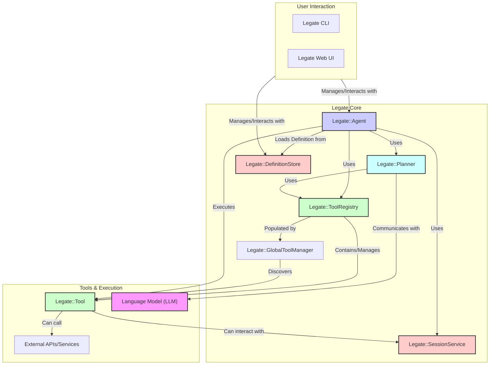

# Legate Architecture Overview

This document provides a high-level overview of the Legate — AI Agent Framework for Ruby — library, its core components, and how they interact to enable the development and operation of AI agents.

## Core Components Diagram

The following diagram illustrates the main architectural components of the Legate:

## Component Descriptions

*   **User Interaction (CLI/Web UI):** Interfaces for users to create, manage, and interact with agents and their definitions.
*   **`Legate::Agent`:** The central orchestrator. It manages the execution of tasks, interacts with the planner, tools, and session service based on its definition.
*   **`Legate::Planner`:** Responsible for creating a sequence of steps (a plan) for the agent to follow to accomplish a given task. It uses the agent's instructions, available tools, and conversation history, often leveraging an LLM.
*   **`Legate::ToolRegistry`:** An instance-specific collection of tools available to a particular agent. It provides tool metadata to the planner and tool instances to the agent for execution.
*   **`Legate::GlobalToolManager`:** A global registry module (with `self.` class methods) where tool classes are registered. The `ToolRegistry` of an agent is typically populated from this manager.
*   **`Legate::Tool`:** Represents a specific capability or action an agent can perform (e.g., calculator, web search, API call). Tools have defined metadata (name, description, parameters) and an execution method.
*   **`Legate::SessionService`:** Manages the state of an agent's conversation over time, including history of prompts, tool calls, and responses. Uses in-memory storage via `InMemory`.
*   **`Legate::DefinitionStore`:** A module namespace for storing and retrieving agent definitions (configurations like name, instructions, tools to use, model, etc.). Definitions are stored in-memory via `Legate::GlobalDefinitionRegistry`.
*   **Language Model (LLM):** An external AI model (e.g., from OpenAI, Google) that the planner consults to generate plans and that the agent may use to generate final responses.
*   **External APIs/Services:** Third-party services that `Legate::Tool`s might interact with to perform their actions.

## Basic Workflow

A typical agent task execution involves the following simplified flow:

1.  **User Input:** A user provides a prompt or task to an `Legate::Agent` via a CLI or Web UI, usually associated with a `session_id`.
2.  **Agent Activation:** The `Legate::Agent` loads its definition and retrieves the session history using the `Legate::SessionService`.
3.  **Planning:** The agent invokes the `Legate::Planner`. The planner, using the agent's instructions, available tool metadata (from `Legate::ToolRegistry`), and conversation history, consults an LLM to create a plan (a sequence of tool calls).
4.  **Tool Execution:** The agent iterates through the plan:
    *   For each step, it retrieves the appropriate `Legate::Tool` from its `ToolRegistry`.
    *   It executes the tool with the parameters specified in the plan.
    *   The tool performs its action (potentially calling external APIs) and returns a result.
    *   The agent records the tool call and its result in the session history via the `Legate::SessionService`.
5.  **Response Generation:** After plan completion (or if no plan is needed), the agent may use an LLM to generate a final response based on the task and tool results.
6.  **Output:** The agent returns the final response or result to the user, and this event is also saved to the session history.

## Key Concepts

*   **Agent Definition:** The configuration of an agent, specifying its behavior, instructions, and capabilities (tools, model).
*   **Session:** A record of an interaction or conversation with an agent over time, identified by a `session_id`. It includes all events like user prompts, tool calls, and agent responses.
*   **Tool Metadata:** The information that describes a tool to the planner and LLM, including its name, a description of what it does, and the parameters it accepts.
*   **Plan:** A sequence of steps (primarily tool calls) generated by the planner for the agent to execute to achieve a goal.

## Further Reading

For more detailed information on specific components, refer to:

*   [`legate_agent_lifecycle`](./legate_agent_lifecycle)
*   [`legate_tools_and_registry`](../tools/legate_tools_and_registry)
*   [`legate_session_service`](./legate_session_service)
*   [`legate_planner`](./legate_planner)
*   [`legate_configuration`](./legate_configuration)
*   [`legate_definition_store`](./legate_definition_store)
*   [`legate_cli_usage`](../cli/legate_cli_usage)
*   [`http_client_usage`](../guides/http_client_usage)
*   [`mcp_client_integration`](../guides/mcp_client_integration)
*   [`mcp_server_exposure`](../guides/mcp_server_exposure)
*   [`configuring_agent_webhooks`](../guides/configuring_agent_webhooks)
*   [`sending_outbound_webhooks`](../guides/sending_outbound_webhooks)
*   [`webhooks`](../guides/webhooks) 