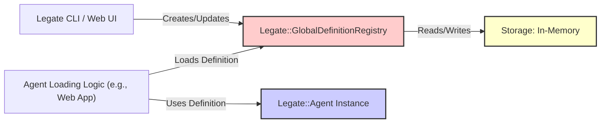

# Legate Definition Store

This document explains the purpose and usage of the Definition Store in the Legate framework, which is responsible for persisting and retrieving agent definitions.

## 1. Purpose

An agent's definition contains its core configuration: name, instructions, description, associated tools, model configuration, webhook settings, etc. While agents can be defined purely in code, storing these definitions externally allows:

*   Creating and managing agents via tools like the Legate CLI or Web UI without modifying application code.
*   Dynamically loading agent configurations at runtime.

The `GlobalDefinitionRegistry` provides the in-memory storage for agent definitions.

## 2. Architecture Overview



*   User interfaces (like the Legate CLI or Web UI) interact with the `GlobalDefinitionRegistry` to save, update, or list agent definitions.
*   Application components that need to run specific agents (like the Legate Web App or a custom script) use the `GlobalDefinitionRegistry` to retrieve the definition by name.
*   The retrieved definition data is then used to initialize an `Legate::Agent` instance.
*   All definitions are stored in-memory via `Legate::GlobalDefinitionRegistry`.

## 3. `Legate::GlobalDefinitionRegistry`

This is the primary implementation provided by Legate. It stores all agent definitions in-memory.

### 3.1. Initialization

The `GlobalDefinitionRegistry` is a module with class-level methods, so no instantiation is needed. Definitions are registered directly:

```ruby
# Register a definition
definition = Legate::AgentDefinition.new.define do |a|
  a.name :my_agent
  a.description 'My agent'
  a.instruction 'Be helpful.'
end

Legate::GlobalDefinitionRegistry.register(definition)
```

### 3.2. Core Methods

*   **`register(definition)`**: Registers an `AgentDefinition` in the registry.
*   **`find(agent_name) -> AgentDefinition | nil`**: Retrieves the definition for a given agent name. Returns `nil` if not found.
*   **`all -> Array<AgentDefinition>`**: Returns an array of all registered agent definitions.
*   **`definition_exists?(agent_name) -> Boolean`**: Checks if a definition exists for the given name.
*   **`delete_definition(agent_name)`**: Removes an agent definition from the registry.
*   **`clear!`**: Clears all registered definitions (primarily used in testing).

## 4. Usage Examples

### Registering a New Definition

```ruby
definition = Legate::AgentDefinition.new.define do |a|
  a.name :my_new_agent
  a.description "An agent created via the registry."
  a.instruction "Be helpful."
  a.use_tool :calculator
  a.use_tool :echo
  a.model_name "gemini-2.0-flash"
end

Legate::GlobalDefinitionRegistry.register(definition)
puts "Agent definition registered."
```

### Retrieving and Using a Definition

```ruby
agent_name = :my_new_agent

definition = Legate::GlobalDefinitionRegistry.find(agent_name)

if definition
  puts "Found definition: #{definition.inspect}"

  # Instantiate the agent using the definition object
  agent_instance = Legate::Agent.new(definition: definition)
  puts "Agent instance created: #{agent_instance.name}"
  # agent_instance.start # Start the agent if needed
else
  puts "Agent definition '#{agent_name}' not found."
end
```

## Further Reading

*   [`legate_architecture_overview`](./legate_architecture_overview)
*   [`legate_agent_lifecycle`](./legate_agent_lifecycle)
*   [`legate_configuration`](./legate_configuration)
