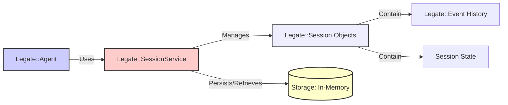

# Legate Session Service

This document explains the role and functionality of the Session Service within the Legate framework. The Session Service is responsible for managing the state and history of conversations between users and agents.

## 1. Purpose

Agents often need to maintain context over multiple turns of a conversation. This includes remembering:

*   Past user inputs.
*   Agent responses.
*   Tools called and their results.
*   Temporary state data relevant to the ongoing task.

The Session Service provides a persistent or in-memory store for this information, encapsulated within `Legate::Session` objects.

## 2. Architecture Overview



*   The `Legate::Agent` interacts with a configured `SessionService` implementation.
*   The `SessionService` is responsible for creating, retrieving, saving, and deleting `Legate::Session` instances.
*   Each `Legate::Session` holds the list of `Legate::Event`s constituting the conversation history and a key-value store for session-specific state.
*   The `SessionService` implementation dictates how Sessions are stored (in memory).

## 3. Core Interface (`Legate::SessionService::Base`)

All session service implementations should adhere to the interface defined by `Legate::SessionService::Base` (though Ruby doesn't enforce interfaces strictly). Key methods include:

*   **`persistent?() -> Boolean`**: Returns whether this service persists state.
*   **`save_scoped_state(scope, key, value)`**: Saves a key-value pair within a specific scope (e.g., `'user'`, `'app'`, `'temp'`).
*   **`load_scoped_state(scope, key) -> Object | nil`**: Retrieves a value associated with a specific key within a given scope.
*   **`clear_scoped_state(scope, key)`**: Clears a key within a specific scope.
*   **`append_event(session_id:, event:)`**: Adds a new `Legate::Event` to the specified session's history.
*   **`set_state(session_id:, key:, value:)`**: Sets a key-value pair in the state associated with a session.
*   **`get_state(session_id:, key:) -> Object | nil`**: Retrieves a value from the state associated with a session.

Note: The concrete implementation `Legate::SessionService::InMemory` also provides additional methods such as `create_session`, `get_session`, and `delete_session` for full session lifecycle management.

## 4. Implementation

Legate provides an in-memory session service:

*   **`Legate::SessionService::InMemory`**: Stores all session data directly in the Ruby process's memory using `Concurrent::Map` for thread safety.
    *   **Pros:** Simple, no external dependencies, fast, thread-safe.
    *   **Cons:** Data is lost when the process restarts. Not suitable for multi-process or distributed deployments.

## 5. Configuration

You configure the session service implementation when setting up the Legate, typically within the `Legate.configure` block:

```ruby
require 'legate/session_service/in_memory'

Legate.configure do |config|
  # Use In-Memory session service
  config.session_service = Legate::SessionService::InMemory.new
end

# Access the configured instance later:
service = Legate.config.session_service
session = service.create_session(app_name: 'my_app', user_id: 'user123')
```

## 6. Interaction with `Legate::Agent`

The `Legate::Agent` relies heavily on the configured Session Service during `run_task`:

1.  It calls `get_session` (or `create_session` implicitly if needed) to load the session context.
2.  It passes the `session_service` instance within the `Legate::ToolContext` to tools, allowing them potential access.
3.  It uses `add_event_to_session` to record user input, tool requests, tool results, and agent responses, thus building the conversation history.
4.  The `Legate::Planner` typically receives the session history (retrieved via `get_session_history` by the agent) to inform its planning process.

## 7. Scoped State (`user:`, `app:`, `temp:`)

The session service supports *scoped state* via key prefixes. This allows organizing key-value data by scope:

*   **`user:<key>`**: Data scoped to a specific `(app_name, user_id)` pair. It is shared across all of that user's sessions within the same application, but **not** across different applications.
*   **`app:<key>`**: Data scoped to a specific `app_name`. It is shared across all users and sessions of that application.
*   **`temp:<key>`**: Data scoped to a single session (keyed by the session `id`).

When using `set_state`, `get_state`, or `delete_state` with a key containing a valid prefix (e.g., `'user:preference'`), the value is persisted through the session **service's** scoped-state store (`save_scoped_state` / `load_scoped_state` / `clear_scoped_state`), not through the session's internal `@state` map. Plain keys without a prefix remain in the session's internal state.

## 8. Serialization

`Legate::Session` and `Legate::Event` objects provide `to_h` methods to convert their state into Ruby Hashes suitable for JSON serialization. Correspondingly, they have `from_h` class methods to reconstruct objects from these Hash representations.

(See `Legate::Session` and `Legate::Event` for details on their attributes and serializable format).

## Further Reading

*   [`legate_architecture_overview`](./legate_architecture_overview)
*   [`legate_agent_lifecycle`](./legate_agent_lifecycle)