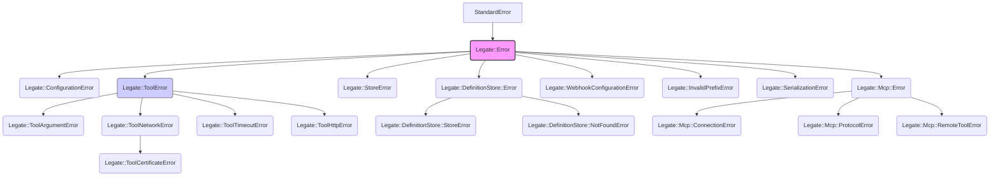

# Legate Error Handling

This guide covers common Legate-specific exception classes and provides an overview of potential error scenarios and how they are typically handled within the framework.

## Philosophy

Legate aims to use specific error classes to help developers pinpoint the source and nature of issues. When tools encounter problems, they should generally raise an appropriate `Legate::ToolError` subclass rather than returning an error status in their result hash. The Legate agent runtime is designed to catch these exceptions and format them into a standard error event for the LLM.

## Core Exception Hierarchy

Most Legate-specific errors inherit from `Legate::Error < StandardError`.

> **Note:** `Legate::DefinitionStore::Error` inherits directly from `Legate::Error`; it is not a subclass of `Legate::StoreError`.

## Key Legate Exception Classes

### 1. `Legate::ConfigurationError`
*   **Purpose**: Raised when there's an issue with the Legate framework's configuration. This could be due to missing required settings, invalid values for configuration parameters (e.g., in `Legate.configure` blocks or environment variables that Legate relies on).
*   **Example Scenarios**: Missing API key, misconfigured session service type.
*   **Typically Handled By**: Application startup checks; often fatal if core services cannot be initialized.

### 2. State Errors (`Legate::InvalidPrefixError`, `Legate::SerializationError`)
*   **`Legate::InvalidPrefixError`**: Raised when an invalid prefix is used in a state key (the recognized scoped prefixes are `user:`, `app:`, and `temp:`).
*   **`Legate::SerializationError`**: Raised when a state value cannot be serialized for persistence.
*   **Typically Handled By**: Session state management logic when reading or writing scoped state.

### 3. `Legate::ToolError` (and its subclasses)
This is a broad category for errors originating from within an Legate tool's execution.

*   **`Legate::ToolError` (Base)**
    *   **Purpose**: Generic error during a tool's execution that doesn't fit a more specific subclass. Often used to wrap unexpected exceptions within a tool.
    *   **Attributes**: Can have a `cause` attribute storing the original exception.
*   **`Legate::ToolArgumentError < Legate::ToolError`**
    *   **Purpose**: Raised when the parameters provided to a tool are invalid (e.g., missing required parameters, incorrect data types, values out of allowed range).
    *   **Example Scenarios**: Calculator tool receiving a string for `operand1`, WebhookTool missing the `url`.
*   **`Legate::ToolNetworkError < Legate::ToolError`**
    *   **Purpose**: General network-related issues encountered by a tool (often an HTTP-based tool). This excludes timeouts or specific HTTP error statuses.
    *   **Example Scenarios**: DNS resolution failure, TCP connection refused (not due to timeout).
*   **`Legate::ToolCertificateError < Legate::ToolNetworkError`**
    *   **Purpose**: Specifically for SSL/TLS certificate validation failures during an HTTPS request by a tool.
*   **`Legate::ToolTimeoutError < Legate::ToolError`**
    *   **Purpose**: Raised when a tool operation (typically a network request) exceeds its allowed timeout.
    *   **Example Scenarios**: HTTP request taking too long to connect or receive a response.
*   **`Legate::ToolHttpError < Legate::ToolError`**
    *   **Purpose**: Raised when an HTTP request made by a tool results in an unsuccessful HTTP status code (e.g., 4xx client errors, 5xx server errors).
    *   **Attributes**: Contains a `response` attribute holding the HTTP response object (e.g., `Excon::Response`), allowing access to status, headers, and body.
    *   **Example Scenarios**: Tool calling an API that returns a 404 Not Found or 500 Internal Server Error.
*   **Typically Handled By**: The `Legate::Agent` catches these. The agent typically creates an error event containing the exception message, which is then presented to the LLM. The LLM might then inform the user or attempt a corrective action.

### 4. `Legate::StoreError` and `Legate::DefinitionStore` Errors
*   **`Legate::StoreError`**: Base error for failures in persistence layers used for sessions or agent definitions.
*   **`Legate::DefinitionStore::Error`**: Base for errors specific to the agent definition store (inherits directly from `Legate::Error`).
*   **`Legate::DefinitionStore::StoreError`**: General errors interacting with the definition store backend.
*   **`Legate::DefinitionStore::NotFoundError`**: A specific agent definition could not be found in the store.
*   **Example Scenarios**: Trying to load a non-existent agent from the `GlobalDefinitionRegistry`.
*   **Typically Handled By**: Agent loading/management logic (e.g., in the Web UI or CLI); may prevent an agent from starting or being used.

### 5. `Legate::Mcp::Error` (and its subclasses)
Errors related to the Model Context Protocol (MCP) for tool communication with external tool servers.
*   **`Legate::Mcp::ConnectionError`**: Problems establishing a connection to an MCP server (including handshake/initialization failures).
*   **`Legate::Mcp::ProtocolError`**: Violations of the MCP JSON-RPC specifications.
*   **`Legate::Mcp::RemoteToolError`**: An error reported by the remote MCP server during the execution of one of its tools. Carries optional `code` and `data` attributes from the remote error.
*   **Example Scenarios**: MCP server is down, malformed JSON-RPC message, tool on MCP server fails.
*   **Typically Handled By**: MCP client logic within Legate; often results in a `ToolError` if an agent was trying to use an MCP-hosted tool.

### 6. `Legate::WebhookConfigurationError`
*   **Purpose**: Raised for webhook configuration or processing errors within the inbound webhook listener (e.g., from a `webhook_transformer` or `webhook_session_extractor` Proc).
*   **Example Scenarios**: A webhook payload is missing required fields, or a session ID cannot be extracted.
*   **Typically Handled By**: The webhook listener, which translates it into an HTTP error response (e.g., `400 Bad Request`).

## General Error Handling in Agents

When an agent executes a tool and the tool raises one of these exceptions (especially `Legate::ToolError` subclasses):
1.  The `Legate::Agent` runtime catches the exception.
2.  It logs the error.
3.  It constructs an `Legate::Event` of type `:error` (or `:tool_error`). This event typically includes:
    *   The name of the tool that failed.
    *   The error message from the exception.
    *   The class name of the exception.
    *   Sometimes, additional details or the original `cause`.
4.  This error event is added to the session history.
5.  The error event (or a summary) is then provided back to the Large Language Model as part of the context for its next turn.
6.  The LLM can then decide how to proceed, which might involve:
    *   Informing the user of the failure.
    *   Trying a different tool or approach.
    *   Asking the user for clarification.

## HTTP Client Error Handling (`Legate::Tools::Base::HttpClient`)

Tools that use the `Legate::Tools::Base::HttpClient` mixin (like `CatFacts` or `WebhookTool`) benefit from standardized error handling for HTTP operations. This mixin automatically wraps common `Excon::Error` exceptions into the more specific `Legate::ToolNetworkError`, `Legate::ToolCertificateError`, `Legate::ToolTimeoutError`, or `Legate::ToolHttpError`.

This ensures consistent error reporting from tools that make external HTTP calls. 