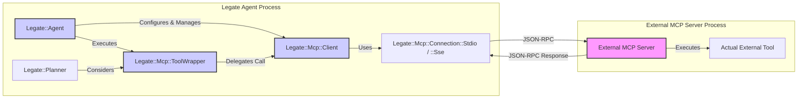

# Using Legate as an MCP Client

This guide explains how to configure and use an `Legate::Agent` to connect to external Model Context Protocol (MCP) servers and utilize the tools they provide. This allows your Legate agents to leverage a wider ecosystem of capabilities beyond their natively defined tools.

## Architecture Overview: Legate as MCP Client

The following diagram illustrates how an Legate Agent interacts with an external MCP server:



**Key Components:**

*   **`Legate::Agent`:** The main Legate agent instance.
*   **`Legate::Mcp::Client`:** Manages the connection and communication with a specific MCP server.
*   **`Legate::Mcp::Connection::Stdio` / `Legate::Mcp::Connection::Sse`:** Handle the low-level transport (STDIO or SSE). The `Legate::Mcp::ConnectionManager` owns the connection lifecycle (connecting, discovering tools, and disconnecting).
*   **`Legate::Mcp::ToolWrapper`:** A dynamically created proxy `Legate::Tool` that represents an external MCP tool within the Legate agent.
*   **External MCP Server:** The third-party server providing tools via MCP.

## 1. Configuration

> ### ⚠️ Security: MCP server configs are trusted input
>
> Connecting to an MCP server means **running code you trust**, exactly like adding a dependency to your project:
>
> - **`:stdio` servers launch a local subprocess** from the configured `command`/`args`. Whoever can set an agent's `mcp_servers` can run arbitrary local commands — that's the whole point of stdio MCP, not a flaw. Treat an MCP config like a `Gemfile` entry.
> - **`:sse`/remote servers are *not* SSRF-restricted.** MCP servers legitimately run on `localhost` or inside your private network, so Legate does **not** block private/loopback/metadata addresses for MCP URLs (unlike the outbound webhook tool, which does). A malicious MCP URL could reach internal services.
>
> The trust boundary is therefore **who can supply an agent definition's `mcp_servers`**. In code you control this is a non-issue. If you let *untrusted users* create or edit agent definitions (e.g. by exposing the bundled web UI on a public network), they can run commands and reach internal hosts on your server. **Do not expose the web UI to untrusted networks** (see the README's "Security model" section), and only configure MCP servers you would be comfortable adding as a dependency.

To enable an agent to act as an MCP client, you configure it with details of the MCP servers it should connect to.

### 1.1. `mcp_servers` on the Agent Definition

MCP server connections are configured on the agent's `Legate::AgentDefinition` via the `mcp_servers` DSL method. Build the definition, then pass it to `Legate::Agent.new(definition:)`:

```ruby
require 'legate'
require 'legate/mcp' # Ensure MCP modules are loaded

# Example: Configuration for an MCP server running via STDIO
stdio_server_config = {
  type: :stdio,  # or "stdio"
  command: 'npx', # The command to run the server
  args: ['@modelcontextprotocol/server-filesystem', '--stdio', '/path/to/accessible/directory']
}

# Example: Configuration for an MCP server via SSE (HTTP Server-Sent Events)
sse_server_config = {
  type: :sse, # or "sse"
  url: 'http://localhost:9292/mcp', # Base URL for the MCP server (SSE endpoint often /sse, messages often /messages)
  # Optional: token: 'your-auth-token' # If the server requires bearer token authentication
}

mcp_client_definition = Legate::AgentDefinition.new.define do |a|
  a.name :mcp_client_agent
  a.description 'An agent that uses external MCP tools.'
  a.instruction 'Use native and external MCP tools to help the user.'

  a.use_tool :my_native_tool          # Optional: native Legate tools
  a.use_tool :read_file               # Selected MCP tool (see section 1.2)
  a.use_tool :list_directory          # Selected MCP tool (see section 1.2)

  # Array of MCP server configs (or pass them as separate arguments)
  a.mcp_servers stdio_server_config, sse_server_config
end

my_agent = Legate::Agent.new(definition: mcp_client_definition)
```

**Each server configuration hash requires:**

*   `type`: Symbol or String. `:stdio` or `:sse`.
*   **For `:stdio`:**
    *   `command`: String. The executable to run the server (e.g., `npx`, `python`, `bundle exec ruby`).
    *   `args`: Array of Strings. Arguments for the command.
*   **For `:sse`:**
    *   `url`: String. The base URL of the MCP server. The client will attempt to connect to standard MCP sub-paths like `/sse` for events and `/messages` for calls.
    *   `token` (Optional): String. A bearer token for authentication if the server requires it.

### 1.2. Selecting MCP Tools with `use_tool` (Crucial for V1)

Due to the dynamic nature of tool discovery and potential for naming conflicts or overwhelming numbers of tools, **it is currently essential to specify which tools from the MCP server(s) the agent should actually register and use.**

You do this with the same `a.use_tool :tool_name` DSL you use for native tools. When the agent starts, the `Legate::Mcp::ConnectionManager` discovers the server's tools and only registers those whose names match a `use_tool` selection:

```ruby
definition = Legate::AgentDefinition.new.define do |a|
  a.name :mcp_client_agent
  a.instruction '...'
  a.mcp_servers some_mcp_server_config
  a.use_tool :tool_name_from_mcp_server1
  a.use_tool :another_tool_from_mcp_server2
end
```

*   `use_tool` takes a Symbol; call it once per tool.
*   These names **must exactly match** the tool names as exposed by the MCP server. You might need to inspect the MCP server's `tools/list` response or its documentation to get the correct names.
*   If none of the agent's selected tool names match a server's tools, the agent will connect to the MCP server and perform the handshake but **will not register any tools** from that server.
*   The Legate planner will only "see" and be able to use MCP tools that were selected via `use_tool` and successfully registered.

## 2. How it Works

1.  **Agent Initialization (`Legate::Agent.new(definition:)`)**:
    *   The `mcp_servers` configurations are read from the definition.
2.  **Agent Start (`agent.start`)**:
    *   The agent's `Legate::Mcp::ConnectionManager` processes each configuration in the definition's `mcp_servers`:
        *   A connection is established using the specified `type` (`Legate::Mcp::Connection::Stdio` or `Legate::Mcp::Connection::Sse`). This includes the MCP `initialize` handshake.
        *   If the connection is successful, the manager calls `tools/list` on the MCP server.
        *   For each tool schema received from the server whose name matches one of the agent's `use_tool` selections:
            *   `Legate::Mcp::ToolWrapper.from_mcp_schema` is called. This method:
                *   Converts the MCP tool's JSON Schema (for `inputSchema`) into the Legate parameter format. (See [Schema Conversion Details](../advanced/mcp_schema_conversion))
                *   Dynamically creates an anonymous `Legate::Tool` subclass that acts as a proxy.
                *   Registers this proxy tool with the agent's specific `ToolRegistry`.
    *   The agent is now aware of both its native tools and the selected, wrapped MCP tools.
3.  **Planning (`agent.run_task`)**:
    *   The `Legate::Planner` considers all tools available in the agent's `ToolRegistry`, including the wrapped MCP tools.
4.  **Execution**:
    *   If the planner selects a wrapped MCP tool:
        *   The agent calls the wrapper tool's `execute` method.
        *   The `ToolWrapper` instance, in its `perform_execution` method:
            *   Translates the Legate parameters into the JSON structure expected by the external tool.
            *   Uses its associated `Legate::Mcp::Client` instance to send a `tools/call` request to the MCP server.
            *   Receives the response from the MCP server.
            *   Maps the MCP result or error back into the standard Legate status hash (e.g., `{status: :success, result: ...}` or `{status: :error, error_details: ...}`).
5.  **Agent Stop (`agent.stop`)**:
    *   The agent calls `disconnect` on all active `Legate::Mcp::Client` instances, terminating connections (e.g., stopping STDIO processes, closing SSE connections).

## 3. Error Handling

*   **Connection Errors**: If an `Legate::Mcp::Client` fails to connect during `agent.start` (e.g., STDIO command not found, SSE server unreachable, MCP handshake fails), an error is logged. That specific MCP server and its tools will be unavailable to the agent. The agent will typically continue starting with its native tools and any other successfully connected MCP servers.
*   **Tool Execution Errors**:
    *   **Communication Errors (`Legate::Mcp::ConnectionError`, `Legate::Mcp::ProtocolError`)**: These indicate issues with the communication channel or MCP protocol itself (e.g., invalid JSON-RPC, timeout). The `ToolWrapper` catches these and returns an Legate `:error` status hash (e.g., `{status: :error, error_message: "MCP Communication Error: ...", error_details: {mcp_error_type: 'ConnectionError'}}`).
    *   **Remote Tool Errors (`Legate::Mcp::RemoteToolError`)**: These occur if the external MCP server successfully executed the tool, but the tool *itself* reported an error (e.g., via an MCP error object in the `tools/call` response). The `ToolWrapper` converts this into an Legate `:error` status hash, often including the original error message, code, and data from the MCP server in the `error_details` field.
*   **Agent Behavior**: If a plan step involving an external MCP tool fails, the agent's plan execution typically halts, and the final agent response will reflect the error status hash, similar to failures with native tools.

## 4. Example Snippet

```ruby
# (Ensure Legate.configure and MCP server setup as per above)

# Define a native tool for comparison.
# The tool name :native_tool is inferred from the class name.
class NativeTool < Legate::Tool
  tool_description 'A simple native tool.'

  private

  def perform_execution(_params, _context)
    { status: :success, result: 'Native tool executed!' }
  end
end
Legate::GlobalToolManager.register_tool(NativeTool)

# Configure the MCP server (e.g., filesystem server)
# Ensure '/tmp/mcp_test_dir' exists and is accessible by the npx command.
# Create a file: echo "Hello from MCP!" > /tmp/mcp_test_dir/test.txt
mcp_server_config = {
  type: :stdio,
  command: 'npx',
  args: ['@modelcontextprotocol/server-filesystem', '--stdio', '/tmp/mcp_test_dir']
}

definition = Legate::AgentDefinition.new.define do |a|
  a.name :mcp_client_agent
  a.instruction 'Use native and filesystem tools to help the user.'
  a.use_tool :native_tool
  a.use_tool :read_file # Assuming server-filesystem exposes 'read_file'
  a.mcp_servers mcp_server_config
end

agent = Legate::Agent.new(definition: definition)

agent.start

Legate.logger.info("Agent Tools Available: #{agent.available_tools_metadata.map { |t| t[:name] }}")

# Example task
session_service = Legate::SessionService::InMemory.new
session_id = session_service.create_session(app_name: agent.name, user_id: 'test').id

# This prompt assumes the LLM/planner knows to use 'read_file' for such a request
user_input = "Can you read the file named 'test.txt' for me?"

final_event = agent.run_task(
  session_id: session_id,
  user_input: user_input,
  session_service: session_service
)

Legate.logger.info("Agent Task Result: #{final_event.content.inspect}")

agent.stop
```
*For a more complete, runnable example, see `examples/14_mcp_client.rb` in the `legate` repository.*

## 5. Security Considerations

*   **STDIO Connections**: Assume a trusted local environment. The commands specified are executed on the system where `legate` is running.
*   **SSE Connections**:
    *   Use HTTPS (`https://...`) for the MCP server URL in production to protect data in transit.
    *   If the server requires authentication, provide the token via the `token` parameter in the SSE configuration. Manage this token securely.
*   **Trust**: By configuring an agent to connect to an MCP server, you are trusting that server and the tools it exposes. Be cautious about connecting to untrusted MCP servers, as they can execute code or access resources based on the tools they provide.
*   **Selected Tools**: The `use_tool` selection mechanism provides a layer of control, ensuring that only explicitly approved tools from an MCP server are made available to the agent. 