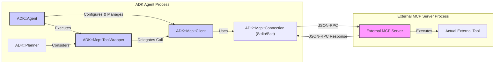

# Using ADK-Ruby as an MCP Client

This guide explains how to configure and use an `ADK::Agent` to connect to external Model Context Protocol (MCP) servers and utilize the tools they provide. This allows your ADK agents to leverage a wider ecosystem of capabilities beyond their natively defined tools.

## Architecture Overview: ADK as MCP Client

The following diagram illustrates how an ADK Agent interacts with an external MCP server:



**Key Components:**

*   **`ADK::Agent`:** The main ADK agent instance.
*   **`ADK::Mcp::Client`:** Manages the connection and communication with a specific MCP server.
*   **`ADK::Mcp::Connection`:** Handles the low-level transport (STDIO or SSE).
*   **`ADK::Mcp::ToolWrapper`:** A dynamically created proxy `ADK::Tool` that represents an external MCP tool within the ADK agent.
*   **External MCP Server:** The third-party server providing tools via MCP.

## 1. Configuration

To enable an agent to act as an MCP client, you configure it with details of the MCP servers it should connect to.

### 1.1. `mcp_servers` Agent Option

Pass an array of server configuration hashes to the `mcp_servers` option when initializing your `ADK::Agent`:

```ruby
require 'adk'
require 'adk/mcp' # Ensure MCP modules are loaded

# Example: Configuration for an MCP server running via STDIO
stdio_server_config = {
  type: :stdio,  # or "stdio"
  command: 'npx', # The command to run the server
  args: ['@modelcontextprotocol/server-filesystem', '--stdio', '/path/to/accessible/directory']
}

# Example: Configuration for an MCP server via SSE (HTTP Server-Sent Events)
sse_server_config = {
  type: :sse, # or "sse"
  url: 'http://localhost:9292/mcp', # Base URL for the MCP server (SSE endpoint often /sse, messages often /messages)
  # Optional: token: 'your-auth-token' # If the server requires bearer token authentication
}

my_agent = ADK::Agent.new(
  name: 'mcp_client_agent',
  description: 'An agent that uses external MCP tools.',
  tool_classes: [MyNativeTool],     # Optional: Native ADK tools
  mcp_servers: [stdio_server_config, sse_server_config], # Array of MCP server configs
  selected_tool_names: [:read_file, :list_directory] # IMPORTANT: See section 1.2
)
```

**Each server configuration hash requires:**

*   `type`: Symbol or String. `:stdio` or `:sse`.
*   **For `:stdio`:**
    *   `command`: String. The executable to run the server (e.g., `npx`, `python`, `bundle exec ruby`).
    *   `args`: Array of Strings. Arguments for the command.
*   **For `:sse`:**
    *   `url`: String. The base URL of the MCP server. The client will attempt to connect to standard MCP sub-paths like `/sse` for events and `/messages` for calls.
    *   `token` (Optional): String. A bearer token for authentication if the server requires it.

### 1.2. `selected_tool_names` (Crucial for V1)

Due to the dynamic nature of tool discovery and potential for naming conflicts or overwhelming numbers of tools, **it is currently essential to specify which tools from the MCP server(s) the agent should actually register and use.**

Use the `selected_tool_names:` option in the `ADK::Agent` constructor:

```ruby
my_agent = ADK::Agent.new(
  # ... other options ...
  mcp_servers: [some_mcp_server_config],
  selected_tool_names: [:tool_name_from_mcp_server1, :another_tool_from_mcp_server2]
)
```

*   Provide an array of symbols.
*   These names **must exactly match** the tool names as exposed by the MCP server. You might need to inspect the MCP server's `tools/list` response or its documentation to get the correct names.
*   If `selected_tool_names` is omitted or empty, the agent will connect to the MCP server and perform the handshake but **will not register any tools** from that server.
*   The ADK planner will only "see" and be able to use MCP tools that are listed in `selected_tool_names` and successfully registered.

## 2. How it Works

1.  **Agent Initialization (`ADK::Agent.new`)**:
    *   The `mcp_servers` configurations are stored.
2.  **Agent Start (`agent.start`)**:
    *   For each configuration in `mcp_servers`:
        *   An `ADK::Mcp::Client` instance is created.
        *   The client attempts to `connect` using the specified `type` (`StdioConnection` or `SseConnection`). This includes the MCP `initialize` handshake.
        *   If the connection is successful, the client calls `tools/list` on the MCP server.
        *   For each tool schema received from the server whose name matches one in `selected_tool_names`:
            *   `ADK::Mcp::ToolWrapper.from_mcp_schema` is called. This method:
                *   Converts the MCP tool's JSON Schema (for `inputSchema`) into the ADK parameter format.
                *   Dynamically creates an anonymous `ADK::Tool` subclass that acts as a proxy.
                *   Registers this proxy tool with the agent's specific `ToolRegistry`.
    *   The agent is now aware of both its native tools and the selected, wrapped MCP tools.
3.  **Planning (`agent.run_task`)**:
    *   The `ADK::Planner` considers all tools available in the agent's `ToolRegistry`, including the wrapped MCP tools.
4.  **Execution**:
    *   If the planner selects a wrapped MCP tool:
        *   The agent calls the wrapper tool's `execute` method.
        *   The `ToolWrapper` instance, in its `perform_execution` method:
            *   Translates the ADK parameters into the JSON structure expected by the external tool.
            *   Uses its associated `ADK::Mcp::Client` instance to send a `tools/call` request to the MCP server.
            *   Receives the response from the MCP server.
            *   Maps the MCP result or error back into the standard ADK status hash (e.g., `{status: :success, result: ...}` or `{status: :error, error_details: ...}`).
5.  **Agent Stop (`agent.stop`)**:
    *   The agent calls `disconnect` on all active `ADK::Mcp::Client` instances, terminating connections (e.g., stopping STDIO processes, closing SSE connections).

## 3. Error Handling

*   **Connection Errors**: If an `ADK::Mcp::Client` fails to connect during `agent.start` (e.g., STDIO command not found, SSE server unreachable, MCP handshake fails), an error is logged. That specific MCP server and its tools will be unavailable to the agent. The agent will typically continue starting with its native tools and any other successfully connected MCP servers.
*   **Tool Execution Errors**:
    *   **Communication Errors (`ADK::Mcp::ConnectionError`, `ADK::Mcp::ProtocolError`)**: These indicate issues with the communication channel or MCP protocol itself (e.g., invalid JSON-RPC, timeout). The `ToolWrapper` catches these and returns an ADK `:error` status hash (e.g., `{status: :error, error_message: "MCP Communication Error: ...", error_details: {mcp_error_type: 'ConnectionError'}}`).
    *   **Remote Tool Errors (`ADK::Mcp::RemoteToolError`)**: These occur if the external MCP server successfully executed the tool, but the tool *itself* reported an error (e.g., via an MCP error object in the `tools/call` response). The `ToolWrapper` converts this into an ADK `:error` status hash, often including the original error message, code, and data from the MCP server in the `error_details` field.
*   **Agent Behavior**: If a plan step involving an external MCP tool fails, the agent's plan execution typically halts, and the final agent response will reflect the error status hash, similar to failures with native tools.

## 4. Example Snippet

```ruby
# (Ensure ADK.configure and MCP server setup as per above)

# Define a native tool for comparison
class MyNativeTool < ADK::Tool
  define_metadata(name: :native_tool, description: 'A simple native tool.')
  def perform_execution(params, context); { status: :success, result: 'Native tool executed!' }; end
end

# Configure the MCP server (e.g., filesystem server)
# Ensure '/tmp/mcp_test_dir' exists and is accessible by the npx command.
# Create a file: echo "Hello from MCP!" > /tmp/mcp_test_dir/test.txt
mcp_server_config = {
  type: :stdio,
  command: 'npx',
  args: ['@modelcontextprotocol/server-filesystem', '--stdio', '/tmp/mcp_test_dir']
}

agent = ADK::Agent.new(
  name: 'mcp_client_agent',
  mcp_servers: [mcp_server_config],
  tool_classes: [MyNativeTool],
  selected_tool_names: [:read_file] # Assuming server-filesystem exposes 'read_file'
)

agent.start

ADK.logger.info("Agent Tools Available: #{agent.available_tools_metadata.map { |t| t[:name] }}")

# Example task
session_service = ADK::SessionService::InMemory.new
session_id = session_service.create_session(app_name: agent.name, user_id: 'test').id

# This prompt assumes the LLM/planner knows to use 'read_file' for such a request
user_input = "Can you read the file named 'test.txt' for me?"

final_event = agent.run_task(
  session_id: session_id,
  user_input: user_input,
  session_service: session_service
)

ADK.logger.info("Agent Task Result: #{final_event.content.inspect}")

agent.stop
```
*For a more complete, runnable example, see `examples/mcp_client_agent_example.rb` in the `adk-ruby` repository.*

## 5. Security Considerations

*   **STDIO Connections**: Assume a trusted local environment. The commands specified are executed on the system where `adk-ruby` is running.
*   **SSE Connections**:
    *   Use HTTPS (`https://...`) for the MCP server URL in production to protect data in transit.
    *   If the server requires authentication, provide the token via the `token` parameter in the SSE configuration. Manage this token securely.
*   **Trust**: By configuring an agent to connect to an MCP server, you are trusting that server and the tools it exposes. Be cautious about connecting to untrusted MCP servers, as they can execute code or access resources based on the tools they provide.
*   **Selected Tools**: The `selected_tool_names` mechanism provides a layer of control, ensuring that only explicitly approved tools from an MCP server are made available to the agent. 