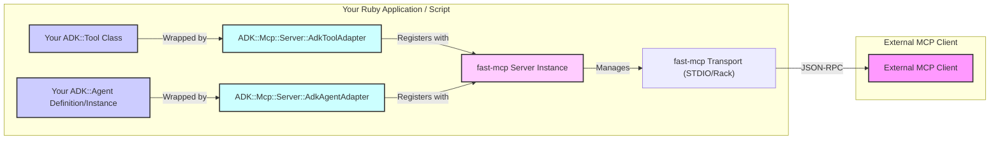

# Exposing ADK Components via MCP

This guide explains how to make your `ADK::Tool`s (and experimentally, `ADK::Agent`s) available to external MCP clients. This is achieved by using provided adapters with the [`fast-mcp`](https://github.com/yjacquin/fast-mcp) Ruby gem, which handles the MCP server implementation.

**Prerequisite**: You must have the `fast-mcp` gem included in your project's Gemfile and installed (`bundle add fast_mcp`).

## Architecture Overview: ADK as MCP Service Provider

The following diagram illustrates how ADK components are wrapped and exposed via `fast-mcp`:



**Key Components:**

*   **`ADK::Tool` / `ADK::Agent`**: Your existing ADK components.
*   **`ADK::Mcp::Server::AdkToolAdapter`**: Wraps an `ADK::Tool` class to make it compatible with `fast-mcp`.
*   **`ADK::Mcp::Server::AdkAgentAdapter` / `AdkDirectAgentAdapter`**: Wraps an `ADK::Agent` (either a Redis definition or a direct instance) to expose it as a single MCP tool.
*   **`fast-mcp Server Instance`**: The MCP server provided by the `fast-mcp` gem.
*   **`fast-mcp Transport`**: How the `fast-mcp` server communicates (e.g., STDIO, Rack middleware for HTTP/SSE).

## 1. Exposing ADK Tools

Use the `ADK::Mcp::Server::AdkToolAdapter.wrap` method to create a `fast-mcp` compatible tool class from your existing `ADK::Tool` subclass.

### 1.1. Wrapping a Tool

```ruby
require 'adk'
require 'fast_mcp'
require 'adk/mcp/server/adk_tool_adapter'
require 'adk/tools/calculator' # Example ADK tool

# Configure ADK logger if needed
# ADK.configure { |c| c.log_level = Logger::INFO }

# 1. Wrap your ADK::Tool class
AdaptedCalculatorTool = ADK::Mcp::Server::AdkToolAdapter.wrap(ADK::Tools::Calculator)

# 2. Create and configure the fast-mcp server
mcp_server = FastMcp::Server.new(
  name: 'adk-tool-server',
  version: ADK::VERSION,
  logger: ADK.logger # Optional: Use ADK's logger
)

# 3. Register the adapted tool with the fast-mcp server
mcp_server.register_tool(AdaptedCalculatorTool)

# 4. Start the server (e.g., using STDIO transport)
ADK.logger.info("Starting ADK MCP Tool Server via STDIO...")
mcp_server.start # This will block and listen on STDIN/STDOUT
```

### 1.2. How it Works (Tool Adapter)

*   `AdkToolAdapter.wrap(YourAdkToolClass)`:
    *   Retrieves metadata (name, description, parameters) from `YourAdkToolClass`.
    *   Uses `ADK::Mcp::Util::SchemaConverter.adk_to_dry_schema` to convert ADK parameter definitions into a `Dry::Schema` block for `fast-mcp` argument validation.
    *   Dynamically creates a new class that inherits from `FastMcp::Tool`.
    *   The `call` method of this new class will:
        *   Instantiate `YourAdkToolClass`.
        *   Create a dummy `ADK::ToolContext` (as there's no ADK session in this server context).
        *   Execute `your_adk_tool_instance.execute(params, dummy_context)`.
        *   Translate the ADK result hash (`{status: :success, result: ...}` or `{status: :error, ...}`) into a format `fast-mcp` expects (either direct result or raises an error).

### 1.3. Handling Asynchronous ADK Tools

If your ADK tool is asynchronous (returns `{status: :pending, job_id: ...}`), the `AdkToolAdapter` will return a corresponding MCP-friendly pending response (e.g., `{'status': 'pending', 'job_id': '...'}`).

To allow clients to check the status of these jobs, you **must** also wrap and expose the `ADK::Tools::CheckJobStatusTool`:

```ruby
require 'adk/tools/base_async_job_tool' # If defining your own async tool
require 'adk/tools/sleepy_tool'       # Example ADK async tool
require 'adk/tools/check_job_status_tool'

# ... (fast_mcp server setup) ...

AdaptedSleepyTool = ADK::Mcp::Server::AdkToolAdapter.wrap(ADK::Tools::SleepyTool)
AdaptedCheckJobStatusTool = ADK::Mcp::Server::AdkToolAdapter.wrap(ADK::Tools::CheckJobStatusTool)

mcp_server.register_tool(AdaptedSleepyTool)
mcp_server.register_tool(AdaptedCheckJobStatusTool) # Crucial for async tools!

# ... (start server) ...
```
Clients will then call your async tool, get a `job_id`, and use the exposed `check_job_status` tool to poll for completion.

## 2. Exposing ADK Agents (Experimental)

You can wrap an entire ADK Agent and expose its `run_task` functionality as a single MCP tool. This is useful for providing a simple, prompt-based interface to your agent for external MCP clients.

Two adapters are available:

*   **`ADK::Mcp::Server::AdkAgentAdapter`**: For agents defined and stored in **Redis** (e.g., created via `adk agent create`).
*   **`ADK::Mcp::Server::AdkDirectAgentAdapter`**: For `ADK::Agent` instances created directly in your Ruby code.

### 2.1. Using `AdkAgentAdapter` (Redis Definition)

**Prerequisites:**
*   Your agent definition must exist in Redis.
*   The ADK framework must be configured to connect to your Redis instance.
*   An `ADK::SessionService` instance is needed by the adapter for temporary session management.

```ruby
require 'adk/mcp/server/adk_agent_adapter'
require 'adk/session_service/in_memory' # Or RedisSessionService

# Ensure ADK is configured for Redis (e.g., via ENV vars or ADK.configure)

AGENT_NAME_IN_REDIS = 'my_chat_agent' # The name of your agent in Redis
session_service = ADK::SessionService::InMemory.new

# 1. Wrap the agent definition from Redis
AdaptedRedisAgent = ADK::Mcp::Server::AdkAgentAdapter.wrap(AGENT_NAME_IN_REDIS, session_service)

# 2. Setup fast-mcp server and register AdaptedRedisAgent
# ... (as shown in Tool Adapter example) ...
mcp_server.register_tool(AdaptedRedisAgent)
# ... (start server) ...
```
This will expose a tool named something like `run_agent_my_chat_agent` that accepts a `prompt` argument.

### 2.2. Using `AdkDirectAgentAdapter` (Ruby Instance)

**Prerequisites:**
*   An `ADK::Agent` instance created in your Ruby code.
*   An `ADK::SessionService` instance.

```ruby
require 'adk/mcp/server/adk_direct_agent_adapter'
require 'adk/session_service/in_memory'
require 'adk/tools/echo' # Example tool for the agent

# 1. Create your ADK Agent instance
my_agent_instance = ADK::Agent.new(
  name: "my_code_defined_agent",
  tool_classes: [ADK::Tools::Echo]
)
# Do NOT call my_agent_instance.start() here if only using for MCP wrapping.

session_service = ADK::SessionService::InMemory.new

# 2. Wrap the agent *instance*
AdaptedDirectAgent = ADK::Mcp::Server::AdkDirectAgentAdapter.wrap(my_agent_instance, session_service)

# 3. Setup fast-mcp server and register AdaptedDirectAgent
# ... (as shown in Tool Adapter example) ...
mcp_server.register_tool(AdaptedDirectAgent)
# ... (start server) ...
```
This will expose a tool named `run_agent_my_code_defined_agent`.

### 2.3. Agent Adapter Limitations (Current Version)

*   **Stateless Execution**: Each call to the wrapped agent tool via MCP is treated as a new, isolated interaction. A temporary ADK session is created for the `run_task` call and then deleted. There is no persistent conversation history between MCP calls to the agent tool.
*   **Tool Availability**: For the `AdkAgentAdapter` (Redis-based), any tools specified in the agent's Redis definition must be available in the global `ADK::ToolRegistry` of the Ruby process running the MCP server.

## 3. Server Setup with `fast-mcp`

`fast-mcp` offers different ways to run the MCP server:

*   **STDIO Server (`FastMcp::Server.new` or `FastMcp::Server::Stdio.new`)**:
    *   Listens for JSON-RPC messages on standard input and writes responses to standard output.
    *   Ideal for local development, integration with tools that manage child processes (like `mcp-inspector`), or simple standalone tool/agent servers.
    *   Start by calling `mcp_server.start`.
    *   See `examples/mcp_server_adk_tool.rb` and `examples/mcp_server_agent_redis.rb`.
*   **Rack Middleware (`FastMcp.rack_middleware`)**:
    *   Integrates the MCP server into any Rack-based web application (e.g., Sinatra, Rails).
    *   Adds MCP endpoints (typically `/mcp/messages` for POST and `/mcp/sse` for Server-Sent Events) to your existing app.
    *   Allows clients to connect via HTTP/SSE.
    *   See `examples/mcp_server_rack.rb`.

Refer to the [`fast-mcp` documentation](https://github.com/yjacquin/fast-mcp) for more details on server setup, authentication, and other advanced features.

## 4. Security Considerations

*   When exposing tools and agents via MCP, you are making their functionality available to any client that can connect to your `fast-mcp` server.
*   If using the Rack middleware for an HTTP-accessible server, consider appropriate network security (firewalls, private networks) and authentication mechanisms if needed. `fast-mcp` provides options for token-based authentication (`FastMcp.authenticated_rack_middleware`) and origin checks.
*   Be mindful of the capabilities of the ADK tools and agents you expose. Avoid exposing components that could lead to unintended actions or data access if called by unauthorized clients. 