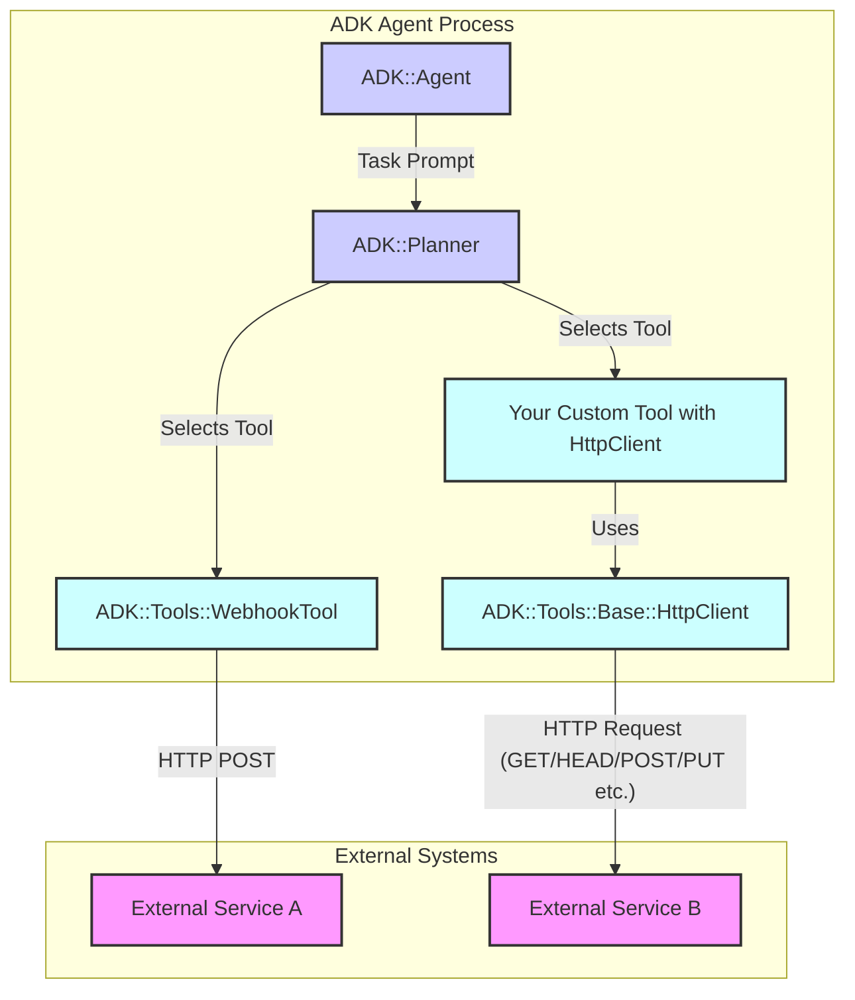

# Sending Outbound Webhooks from ADK Agents

The ADK Agents often need to notify external systems upon completing a task or when a specific event occurs. This can be achieved by sending outbound HTTP requests, commonly known as webhooks.

## Architecture Overview: Sending Outbound Webhooks

The following diagram illustrates the two primary ways an ADK Agent can send outbound webhooks:



**Key Scenarios Depicted:**

1.  **Using `WebhookTool`:** The agent, guided by the planner, uses the built-in `WebhookTool` to send a (typically POST) request to an external service.
2.  **Using a Custom Tool with `HttpClient`:** The agent, guided by the planner, invokes a custom-developed tool. This custom tool then utilizes the `ADK::Tools::Base::HttpClient` module to make more complex or varied HTTP requests to another (or the same) external service.

There are two primary ways to send outbound webhooks from within the ADK framework:

1.  **Using the built-in `WebhookTool`:** A convenient tool specifically designed for sending standard HTTP POST requests with JSON payloads, including optional HMAC-SHA256 signing. This is the recommended approach for common webhook integrations.
2.  **Using the `HttpClient` module within a Custom Tool:** For more complex scenarios requiring different HTTP methods (GET, PUT, etc.), custom headers, non-JSON bodies, or more intricate logic before/after the request, you can create a custom tool that utilizes the `ADK::Tools::Base::HttpClient` mixin.

## 1. Using the `WebhookTool`

The `ADK::Tools::WebhookTool` provides a simple interface for sending POST requests.

### Adding the Tool to your Agent

Ensure the tool is available to your agent by including it in the agent definition:

```ruby
# my_notifying_agent.rb
ADK::Agent.define do |a|
  a.name :my_notifying_agent
  a.description "Performs a task and notifies an external system."
  # ... other config ...

  a.use_tool :webhook_tool # Make the tool available
end
```

### Instructing the Agent

You instruct the agent to use the tool within its task prompt, providing the necessary parameters.

**`WebhookTool` Parameters:**

*   `url` (String, required): The target URL to send the POST request to.
*   `payload` (Hash | String, required): The data to send.
    *   If a `Hash` is provided, it will be automatically encoded as JSON, and the `Content-Type` header will be set to `application/json; charset=utf-8`.
    *   If a `String` is provided, it will be sent as the raw request body. You might need to specify a `Content-Type` via the `headers` parameter if the receiving system requires it.
*   `secret` (String, optional): If provided, the tool will calculate an HMAC-SHA256 signature of the request body using this secret. The signature will be added to the request headers as `X-Hub-Signature-256: sha256=<calculated_signature>`. **Note:** Passing secrets directly in agent prompts can have security implications. Consider if a custom tool with configured secrets is more appropriate for sensitive integrations.
*   `headers` (Hash, optional): Additional custom headers to include in the request (e.g., `{'Authorization': 'Bearer ...'}`). These are merged with default headers like `User-Agent` and the automatically added `Content-Type` (for Hash payloads) or `X-Hub-Signature-256` (if `secret` is used).

**Example Agent Prompt:**

```
"Analyze the provided data file. Once the analysis is complete and saved, use the `webhook_tool` to notify the monitoring system. Send a POST request with the following parameters:
- url: 'https://monitor.example.com/api/v1/updates'
- payload: A JSON object like {'task_id': '12345', 'status': 'completed', 'result_summary': 'Analysis finished successfully.'}
- secret: 'my-monitoring-api-secret'
- headers: {'X-Source-System': 'ADK-Agent'}"
```

### Result

The `webhook_tool` will return a result indicating success or failure:

*   **Success:** `{ status: :success, result: { response_status: <Integer>, response_body: <String> } }`
*   **Failure:** Raises an `ADK::ToolError` (or a subclass like `ADK::ToolHttpError`, `ADK::ToolTimeoutError`) which the agent should handle or report.

## 2. Using `HttpClient` in a Custom Tool

For more control over the HTTP request (e.g., using methods other than POST, sending non-JSON data, complex authentication headers, custom retry logic), create a dedicated custom tool that includes the `ADK::Tools::Base::HttpClient` module.

**Important:** The agent itself *cannot* directly call `http_get`, `http_post`, etc. It must invoke a *custom tool* that encapsulates this logic.

### Creating the Custom Tool

```ruby
# lib/my_app/tools/notification_tool.rb
require 'adk/tools/base_tool'
require 'adk/tools/base/http_client'
require 'json'
require 'openssl' # If manual signing is needed

module MyApp
  module Tools
    class NotificationTool < ADK::Tools::BaseTool
      include ADK::Tools::Base::HttpClient

      tool_name :notification_tool # Register the tool
      tool_description "Sends notifications to a specific internal system."

      parameter :endpoint, type: :string, required: true, description: "The API endpoint path (e.g., '/events')."
      parameter :event_data, type: :hash, required: true, description: "Data for the notification payload."
      parameter :http_method, type: :string, required: false, default: 'POST', description: "HTTP method (POST, PUT, etc.)."

      def initialize(**options)
        super(**options)
        # Setup HttpClient - read base URL/secret from ENV or config
        # IMPORTANT: Avoid hardcoding secrets!
        @api_base_url = ENV.fetch('NOTIFICATION_API_URL', 'https://internal.example.com/api')
        @api_secret = ENV['NOTIFICATION_API_SECRET'] # Optional secret

        setup_http_client(
          base_url: @api_base_url,
          headers: { 'Accept' => 'application/json' },
          options: { read_timeout: 10 }
        )
      end

      private

      def perform_execution(params, context)
        endpoint = params.fetch(:endpoint)
        event_data = params.fetch(:event_data)
        http_method = params.fetch(:http_method).downcase.to_sym

        request_headers = {}
        request_body = JSON.generate(event_data) rescue event_data.to_s # Ensure JSON encoding

        # Example: Manual HMAC Signing (if not using WebhookTool's secret param)
        if @api_secret
          signature = OpenSSL::HMAC.hexdigest('sha256', @api_secret, request_body)
          request_headers['X-Internal-Signature-256'] = "sha256=#{signature}"
        end
        # Always set Content-Type for JSON body when using HttpClient directly
        request_headers['Content-Type'] = 'application/json; charset=utf-8'

        begin
          response = make_request(
            http_method,
            endpoint, # Path relative to base_url
            body: request_body,
            headers: request_headers
          )
          ADK.logger.info "NotificationTool: Successfully sent #{http_method.upcase} to #{endpoint}. Status: #{response.status}"
          # Return a success indicator
          { status: :success, response_code: response.status }
        rescue ADK::ToolHttpError => e
          ADK.logger.error "NotificationTool: HTTP Error sending to #{endpoint}. Status: #{e.response&.status}. Body: #{e.response&.body}"
          # Re-raise or return structured error
          raise ADK::ToolError, "Failed to send notification (HTTP #{e.response&.status})"
        rescue ADK::ToolError => e # Includes timeouts, network errors etc.
          ADK.logger.error "NotificationTool: Error sending to #{endpoint}: #{e.message}"
          # Re-raise or return structured error
          raise ADK::ToolError, "Failed to send notification: #{e.message}"
        end
      end
    end
  end
end
```

*(See [`http_client_usage`](./http_client_usage) for full details on using the `HttpClient` module).*

### Adding the Custom Tool to your Agent

```ruby
# my_complex_agent.rb
# require 'my_app/tools/notification_tool' # Make sure tool class is loaded

ADK::Agent.define do |a|
  a.name :my_complex_agent
  # ...

  a.use_tool :notification_tool # Use the custom tool
end
```

### Instructing the Agent (to use the Custom Tool)

```
"After processing the order (ID: #{order_id}), use the `notification_tool` to inform the fulfillment system. Use the endpoint '/order_updates' and send the following event_data as JSON: {'orderId': '#{order_id}', 'status': 'processed', 'items': [...]}. Use the default POST method."
```

## Choosing the Right Approach

*   Use **`WebhookTool`** if:
    *   You need to send a simple HTTP POST request.
    *   Your payload is typically JSON (Hash).
    *   You need standard HMAC-SHA256 signing (`X-Hub-Signature-256`).
    *   You are comfortable with the agent prompt potentially containing the signing secret (use with caution).
*   Use **`HttpClient` in a Custom Tool** if:
    *   You need to use other HTTP methods (GET, HEAD, PUT, DELETE, etc.).
    *   You need to send non-JSON request bodies (e.g., XML, form data) and manage `Content-Type` manually.
    *   You require complex custom headers or authentication schemes beyond simple HMAC.
    *   You need to perform logic before or after the HTTP request within the tool itself.
    *   You want to manage API secrets within the tool's configuration (e.g., via ENV variables) rather than passing them via agent parameters.

## Security Considerations

*   **Secrets Management:** Avoid hardcoding secrets. Use environment variables or a dedicated configuration management system to provide secrets (like API keys or webhook signing keys) to your custom tools or potentially to the `WebhookTool`'s `secret` parameter (though configuring them in the tool is generally safer than passing via LLM prompt).
*   **URL Validation:** Ensure the URLs being targeted by your webhooks are intended and trusted. Be cautious if URLs are dynamically generated based on user input. 