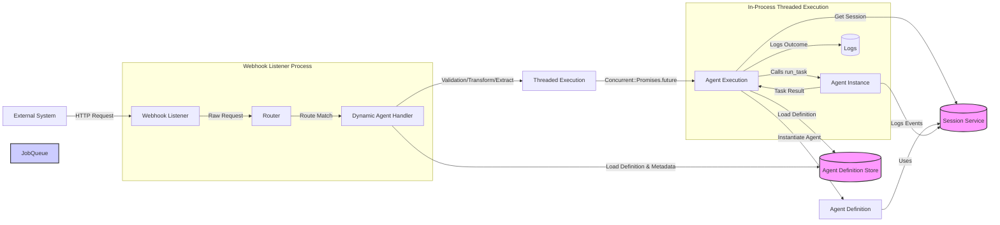

# Using Inbound Webhooks in Legate

This document explains how to configure and use the inbound webhook feature in the Legate framework to trigger agent tasks from external systems.

## Goal

The primary goal of this feature is to allow external events (e.g., Git pushes, CI/CD notifications, CRM updates, IoT alerts) to initiate specific agent workflows asynchronously without requiring direct code integration or constantly running agent processes.

## Architecture Overview

The following diagram illustrates the flow of an inbound webhook request triggering an agent task:



**Key Components:**

*   **Webhook Listener:** Receives HTTP requests, performs initial routing.
*   **Dynamic Agent Handler:** Looks up agent definitions, validates, transforms, extracts session IDs based on agent metadata, and enqueues jobs.
*   **Threaded Execution (`Concurrent::Promises.future`):** Runs webhook tasks asynchronously in background threads within the same process.
*   **Agent Execution:** Loads definitions, instantiates agents, interacts with the Session Service, and executes `agent.run_task`.
*   **Agent Definition Store:** Stores agent configurations, including webhook metadata.
*   **Session Service:** Manages agent conversation state.

## Enabling the Webhook Listener

To receive webhooks, you first need to enable the built-in listener application within your Legate configuration (e.g., in `config/initializers/legate.rb` or your main setup file).

```ruby
# config/initializers/legate.rb or similar
require 'legate'

Legate.configure do |config|
  # --- Enable the listener --- 
  config.webhooks.listener_enabled = true

  # --- Optional Listener Settings --- 
  # Address to bind to (default: '127.0.0.1')
  # Use '0.0.0.0' to listen on all interfaces (common for containers/production)
  config.webhooks.listen_address = "0.0.0.0" 
  
  # Port to listen on (default: 9292)
  config.webhooks.listen_port = 9293 

  # Base path for all webhook routes (default: '/webhooks')
  config.webhooks.base_path = "/myhooks"

  # ... other Legate configurations ...
end
```

When `listener_enabled` is `true`, the `legate web start` command will automatically mount the listener alongside the main Web UI (in development/test environments). For production, see the Deployment section.

## Triggering Agents via Webhook

The recommended way to trigger specific agents is using the dynamic agent route handler.

### Enabling the Dynamic Handler

Enable the dynamic route in your Legate configuration:

```ruby
Legate.configure do |config|
  config.webhooks.listener_enabled = true
  # ... other listener settings ...

  # --- Enable the dynamic route --- 
  config.webhooks.enable_dynamic_agent_handler = true

  # --- Optional: Customize the route pattern ---
  # The default pattern includes :agent_name parameter.
  # config.webhooks.dynamic_agent_route_pattern = '/invoke/:agent_name' # Example override
  
  # ... other Legate configurations ...
end
```

With the default settings (`base_path = '/webhooks'`, `dynamic_agent_route_pattern = '/agents/:agent_name/trigger'`), you can trigger an agent named `:my_cool_agent` by sending a `POST` request to:

`POST /webhooks/agents/my_cool_agent/trigger`

### Configuring an Agent to Receive Webhooks

For an agent to be triggerable via the dynamic route, you **must** configure specific metadata within its definition:

```ruby
# app/agents/my_webhook_agent.rb (or loaded via DefinitionStore)
require 'legate'

Legate::Agent.define do |a|
  a.name :my_webhook_agent
  a.description "Processes incoming data from external service X."
  a.instruction "Summarize the provided data."
  # ... other agent settings (tools, model) ...

  # --- Webhook Configuration Metadata --- 
  
  # 1. Enable Webhook Triggering (REQUIRED)
  # MUST be true for the dynamic route to work for this agent.
  a.webhook_enabled true 

  # 2. Define Payload Transformation (REQUIRED if enabled)
  # A Proc that takes the parsed request body (Hash/Array) and returns
  # the specific String or Hash expected by this agent's `run_task` `user_input`.
  a.webhook_transformer ->(request_body) do
    # Example: Extract data from a specific key
    data = request_body['important_data']
    unless data
      # You can raise errors for invalid payloads
      raise Legate::WebhookConfigurationError, "Missing 'important_data' in webhook payload."
    end
    "Summarize this: #{data}" # Return the user_input for run_task
  end

  # 3. Define Session ID Extraction (REQUIRED if enabled)
  # A Proc that takes the parsed request body and returns a String 
  # to be used as the session_id for this task.
  # Allows grouping related events (e.g., multiple events for the same resource).
  a.webhook_session_extractor ->(request_body) do
    # Example: Use a resource ID from the payload
    resource_id = request_body.dig('resource', 'id') 
    raise Legate::WebhookConfigurationError, "Missing resource ID in payload." unless resource_id
    "external_resource_#{resource_id}" # Return the session_id string
  end

  # 4. Configure Validation (Optional, but Recommended)
  # Option A: Use a globally registered named validator (see below)
  a.webhook_validator :hmac_sha256 
  # Option B: Provide a custom Proc directly
  # a.webhook_validator ->(request, secret) { request.params['token'] == secret }

  # 5. Provide a Secret for the Validator (Optional)
  # Used by the validator logic (e.g., the HMAC key or the token).
  a.webhook_secret ENV['MY_SERVICE_X_WEBHOOK_SECRET'] 
end
```

**Key Requirements:**
*   `webhook_enabled` **must** be set to `true`.
*   `webhook_transformer` Proc **must** be defined.
*   `webhook_session_extractor` Proc **must** be defined.

If these are not met, the dynamic route handler will return an error (likely 404 or 500) when a request for that agent is received.

## Request Validation

It's highly recommended to validate incoming webhooks to ensure they originate from the expected source.

### Using Named Validators (HMAC Example)

You can define reusable validation logic globally in your Legate configuration and reference it by name in your agent definitions.

> **Note:** Legate already ships with a built-in `:hmac_sha256` validator (registered automatically), so you can reference `a.webhook_validator :hmac_sha256` without defining it yourself. The example below shows how an equivalent validator is implemented if you want to register your own.

```ruby
# config/initializers/legate.rb or similar
require 'openssl'

Legate.configure do |config|
  # ... listener config ...
  config.webhooks.enable_dynamic_agent_handler = true

  # --- Define a named HMAC SHA256 validator ---
  config.webhooks.register_validator(:hmac_sha256) do |request, secret|
    # Ensure a secret is configured for the agent/route
    return false unless secret 
    # GitHub example: X-Hub-Signature-256: sha256=...
    signature_header = request.env['HTTP_X_HUB_SIGNATURE_256']
    return false unless signature_header&.start_with?('sha256=')
    
    expected_signature = signature_header.delete_prefix('sha256=')
    
    request.body.rewind # Read body for calculation
    payload_body = request.body.read
    request.body.rewind # Rewind for transformer
    
    calculated_signature = OpenSSL::HMAC.hexdigest('sha256', secret, payload_body)
    
    # Compare in constant time to prevent timing attacks. A length check is
    # required first because OpenSSL.fixed_length_secure_compare raises on
    # unequal-length inputs.
    calculated_signature.bytesize == expected_signature.bytesize &&
      OpenSSL.fixed_length_secure_compare(calculated_signature, expected_signature)
  end

  # Optional: Define a global secret if many agents share one
  # config.webhooks.global_secret = ENV['LEGATE_GLOBAL_WEBHOOK_SECRET']
  
  # Optional: Set a default validator if an agent doesn't define one
  # config.webhooks.global_validator = :hmac_sha256
end
```

Then, in your agent definition, reference the validator and provide the secret:

```ruby
Legate::Agent.define do |a|
  # ... name, description, transformer, extractor ...
  a.webhook_enabled true
  a.webhook_validator :hmac_sha256 # Use the named validator
  a.webhook_secret ENV['SPECIFIC_AGENT_WEBHOOK_SECRET'] # Provide the secret
end
```

### Using Custom Validator Procs

For unique validation logic, provide a Proc directly in the agent definition:

```ruby
Legate::Agent.define do |a|
  # ... name, description, transformer, extractor ...
  a.webhook_enabled true
  a.webhook_validator ->(request, secret) do 
    # Example: Check a query parameter against the secret
    request.params['auth_token'] == secret
  end
  a.webhook_secret ENV['AGENT_AUTH_TOKEN']
end
```

The validator proc receives the Rack `request` object and the configured `secret` string (or `nil` if none is set).

## Workflow Overview

1.  **External System** sends `POST /webhooks/agents/agent_name/trigger` with a JSON payload.
2.  **WebhookListener** receives the request.
3.  **Dynamic Handler** matches the route pattern (`/agents/:agent_name/trigger`).
4.  Handler loads the `:agent_name` **Agent Definition**.
5.  Checks `webhook_enabled` (must be `true`).
6.  Performs **Validation** using `webhook_validator` and `webhook_secret`.
7.  If valid, performs **Transformation** using `webhook_transformer` to get `user_input`.
8.  Extracts **Session ID** using `webhook_session_extractor`.
9.  Constructs a **Job Payload** (`agent_name`, `session_id`, `user_input`, session service config).
10. Dispatches the task via `Concurrent::Promises.future` for **threaded execution**.
11. Listener returns **`202 Accepted`** to the external system.
12. The background thread instantiates the **Session Service**.
13. The thread loads the **Agent Definition**.
14. The thread instantiates the **Agent** using the definition.
15. The thread calls `agent.run_task(session_id:, user_input:, session_service:)`.
16. `run_task` executes the agent logic (planning, tool use).
17. The thread logs the outcome.

## Security Considerations

*   **HTTPS:** Always serve the webhook listener over HTTPS in production.
*   **Secret Management:** Use environment variables or a secure secret management system for `webhook_secret` values. Never hardcode secrets.
*   **Validation:** Strongly recommend validation (e.g., HMAC) for all webhooks triggering actions or handling sensitive data.
*   **Input Sanitization:** Be mindful of how the `transformed_user_input` is used within your agent's instructions and tools to prevent potential injection issues.
*   **Rate Limiting:** Consider adding rate limiting middleware (e.g., `rack-attack`) in front of the listener endpoint to prevent abuse.

## Deployment

*   **Development:** Run `bundle exec legate web start`. If `listener_enabled` is true, the listener will be mounted automatically within the main web server process.
*   **Production:**
    *   You can continue running the combined app as in development.
    *   Alternatively, for better isolation and scaling, you can create a separate `config.ru` and Procfile entry to run the `Legate::Web::WebhookListener` Rack app as a standalone process using a server like Puma or Unicorn.
    *   Webhook jobs run in-process via background threads using `Concurrent::Promises.future`, so no separate worker process is needed. 