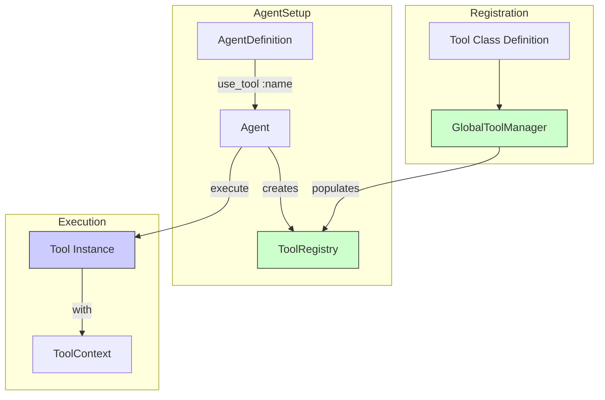
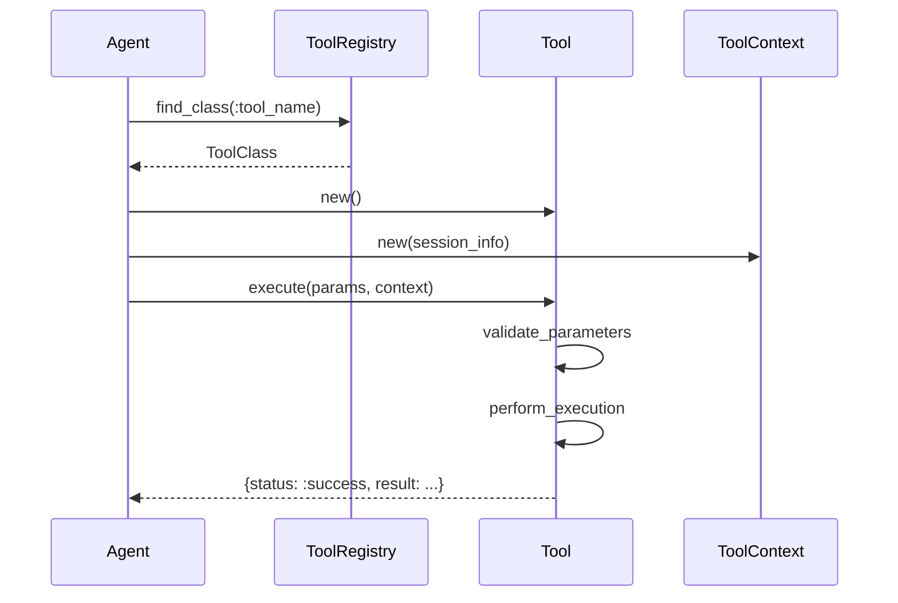

# Legate Tools and Registry

This document describes the tool system in Legate, including how tools are defined, registered, and made available to agents.

## Overview

Legate provides a robust tool system that allows agents to perform actions beyond simple text generation. Tools are Ruby classes that encapsulate specific functionality like performing calculations, making HTTP requests, or delegating tasks to other agents.



## Core Components

### 1. GlobalToolManager

The `Legate::GlobalToolManager` is a global registry where all tool classes are registered. It provides a central place to discover available tools.

**Key Methods:**

| Method | Description |
|--------|-------------|
| `register_tool(tool_class)` | Register a tool class globally |
| `find_class(name_symbol)` | Find a tool class by its symbolic name |
| `list_all_tools` | Get metadata for all registered tools |
| `registered_tool_names` | Get an array of all registered tool name symbols |
| `create_instance(name_symbol)` | Create a new instance of a tool by name |

**Example:**
```ruby
# Registration (typically automatic via inheritance)
Legate::GlobalToolManager.register_tool(MyCustomTool)

# Discovery
available_tools = Legate::GlobalToolManager.list_all_tools
# => [{name: :my_custom_tool, description: "...", parameters: [...]}]

# Instantiation
tool = Legate::GlobalToolManager.create_instance(:calculator)
```

### 2. ToolRegistry

The `Legate::ToolRegistry` is an instance-specific collection of tools available to a particular agent. Each agent has its own ToolRegistry, populated from the GlobalToolManager based on the agent's definition.

**Key Methods:**

| Method | Description |
|--------|-------------|
| `register(name, klass)` | Register a tool class with this registry |
| `find_class(name_symbol)` | Find a tool class by name in this registry |
| `create_instance(name_symbol)` | Create a tool instance |
| `list_tools` | Get metadata for tools in this registry |

**Relationship to Agent:**
```ruby
# When an agent is initialized, its ToolRegistry is populated
definition.tool_names.each do |tool_name|
  klass = Legate::GlobalToolManager.find_class(tool_name)
  agent.tool_registry.register(tool_name, klass)
end
```

## Defining Tools

Tools are defined by creating a class that inherits from `Legate::Tool` and uses the metadata DSL.

```ruby
class WeatherTool < Legate::Tool
  # Description shown to the LLM planner
  tool_description 'Get current weather for a location'
  
  # Define parameters the tool accepts
  parameter :location,
    type: :string,
    description: 'City name or coordinates',
    required: true
  
  parameter :units,
    type: :string,
    description: 'Temperature units: celsius or fahrenheit',
    required: false
  
  private
  
  def perform_execution(params, context)
    location = params[:location]
    units = params[:units] || 'celsius'

    # Tool logic here...

    Legate::ToolResult.success("Weather for #{location}: 72°")
  end
end

# Register the tool (automatic if file is auto-loaded)
Legate::GlobalToolManager.register_tool(WeatherTool)
```

### Return values

`perform_execution` returns either a typed `Legate::ToolResult` or the
equivalent canonical hash — both work:

```ruby
Legate::ToolResult.success(value)            # { status: :success, result: value }
Legate::ToolResult.error('not found')        # { status: :error,   error_message: 'not found' }
Legate::ToolResult.pending(job_id: id)        # { status: :pending, job_id: id }

# Equivalent hashes (unchanged, still supported):
{ status: :success, result: value }
```

`Tool#execute` normalizes a `ToolResult` to the hash, so the rest of the
pipeline is unchanged. The typed form avoids hand-built hashes and mirrors the
`Event#answer` / `#success?` accessors you read results with.

### Tool Metadata DSL

The `Legate::Tool::MetadataDsl` module provides class-level methods for defining tool metadata:

| DSL Method | Purpose |
|------------|---------|
| `tool_name` | Explicitly set the tool's symbolic name |
| `tool_description` | Provide a description for the LLM |
| `parameter(name, options)` | Define an input parameter |

**Parameter Options:**

| Option | Type | Description |
|--------|------|-------------|
| `type` | Symbol | `:string`, `:integer`, `:float`/`:numeric`, `:boolean`, `:array`, `:hash` |
| `description` | String | Description for the LLM |
| `required` | Boolean | Whether the parameter is required |
| `enum` | Array | Allowed values (optional) |

### Tool Name Inference

If `tool_name` is not explicitly set, Legate infers it from the class name:

- `MyCustomTool` → `:my_custom_tool`
- `Calculator` → `:calculator`
- `Legate::Tools::CatFacts` → `:cat_facts`

## Using Tools in Agents

Tools are associated with agents via the `use_tool` method in the agent definition:

```ruby
Legate::AgentDefinition.new.define do |a|
  a.name :my_agent
  # instruction is optional — defaults from the name/description if omitted

  # Reference a registered tool by name (Symbol or String)…
  a.use_tool :calculator
  a.use_tool 'echo'

  # …or pass the class directly: this registers AND selects it in one step,
  # so you don't need a separate GlobalToolManager.register_tool call.
  a.use_tool WeatherTool
end
```

`use_tool` accepts a Symbol, a String (both coerced to a Symbol), or a
`Legate::Tool` subclass. A name that matches no registered tool produces a
warning with a "did you mean?" suggestion and the list of available tools (it
stays non-fatal — MCP tools register when the agent connects).

You can list what's registered with `Legate.tools` (or `legate tool list` /
`legate tool info NAME` from the CLI).

## Tool Execution Flow

When an agent executes a tool:



1. The agent looks up the tool class in its ToolRegistry
2. It creates an instance of the tool
3. It creates a ToolContext with session information
4. It calls `execute(params, context)` on the tool
5. The tool validates parameters and runs `perform_execution`
6. The tool returns a result hash

## ToolContext

The `Legate::ToolContext` object provides tools with access to:

- Session state (`state_get`, `state_set`)
- Session ID, user ID, app name
- Invocation ID for tracking
- Authentication helpers (for tools using the auth module)

```ruby
def perform_execution(params, context)
  # Access session state
  previous_value = context.state_get(:some_key)
  
  # Set state (applied after tool completes)
  context.state_set(:result_key, 'new value')
  
  { status: :success, result: 'Done' }
end
```

## Built-in Tools

Legate provides several built-in tools:

| Tool Name | Description |
|-----------|-------------|
| `:http_request` | SSRF-safe, auth-aware HTTP client |
| `:read_webpage` | Fetches a page as readable text |
| `:current_time` | Current date/time (ISO 8601 / epoch / strftime) |
| `:calculator` | Performs arithmetic operations |
| `:echo` | Echoes back the input message |
| `:cat_facts` | Fetches random cat facts |
| `:webhook_tool` | Sends outbound webhooks |
| `:delegate_task` | Delegates to another agent |
| `:check_job_status` | Checks async job status |
| `:start_sleepy_job` | Demo async/background job |

See [Built-in Tools Reference](./legate_built_in_tools) for detailed documentation.

## Further Reading

*   [`legate_architecture_overview`](../core_concepts/legate_architecture_overview)
*   [`legate_built_in_tools`](./legate_built_in_tools)
*   [`auto_loading`](../guides/auto_loading)
*   [`ai_code_generators`](../guides/ai_code_generators)
