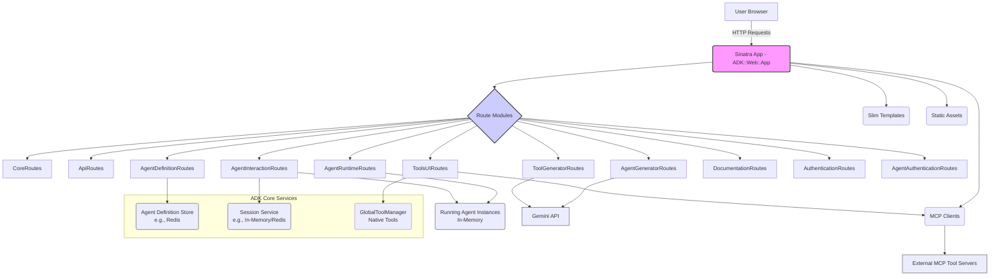

# ADK Web UI Overview

This document provides an overview of the built-in Sinatra web application included with the ADK. It covers its structure, how to run it, and its key features.

## Running the Web UI

The ADK Web UI is a Sinatra application that can be started using the ADK Command Line Interface (CLI).

1.  **Ensure Dependencies**: Make sure you have all necessary gems installed (e.g., by running `bundle install`).
2.  **Environment Configuration**: Some features, like agent definition persistence, rely on services like Redis. Ensure your environment (e.g., `.env` file) is configured with necessary variables like `REDIS_URL`.
3.  **Start Command**: Run the following command from your project root:
    ```bash
    bundle exec adk web start
    ```
4.  **Access**: By default, the UI will be accessible at `http://localhost:4567`. The port can be changed with the `--port` option (e.g., `bundle exec adk web start --port 8080`).

The web application is configured via `config.ru`, which mounts the main application (`ADK::Web::App`) and, if enabled, the `ADK::Web::WebhookListener`.

## Architecture

The ADK Web UI is built using Sinatra and leverages HTMX for dynamic page updates, reducing the need for full page reloads and complex client-side JavaScript.

Key components include:

*   **Main Application (`lib/adk/web/app.rb`)**: The core Sinatra application class. It initializes services, manages application state, and registers various route modules.
*   **Route Modules (`lib/adk/web/routes/`)**: The application's functionality is organized into several route modules:
    *   `CoreRoutes`: Basic application routes (e.g., homepage, dashboard).
    *   `ApiRoutes`: Endpoints for programmatic interaction.
    *   `ToolsUIRoutes`: UI for discovering and managing tools (native and MCP).
    *   `AgentGeneratorRoutes`: AI-powered agent code generation from natural language descriptions.
    *   `ToolGeneratorRoutes`: AI-powered tool code generation from natural language descriptions.
    *   `AgentRuntimeRoutes`: Routes for managing the lifecycle (start/stop) of running agent instances.
    *   `AgentDefinitionRoutes`: UI for creating, viewing, editing, and deleting agent definitions (persistent store, e.g., Redis).
    *   `AgentInteractionRoutes`: Handles chat interactions with agents and direct tool execution.
    *   `DocumentationRoutes`: Serves embedded documentation.
    *   `AuthenticationRoutes`: Manages authentication schemes and credential configuration.
    *   `AgentAuthenticationRoutes`: Per-agent authentication configuration and credential management.
*   **Views (`lib/adk/web/views/`)**: Slim templates are used for rendering HTML.
*   **Static Assets (`lib/adk/web/public/`)**: CSS, JavaScript, and images. Sass/SCSS files in `public/styles` are compiled to `public/css`.
*   **Session Management**: Sinatra sessions are used to store user-specific information, such as active chat session IDs.
*   **Agent Definition Store**: Managed by `ADK::DefinitionStore` (e.g., `ADK::DefinitionStore::RedisStore`), responsible for persisting agent blueprints (name, description, tools, model, etc.).
*   **Agent Runtime Management**: In-memory store (`@agents` in `ADK::Web::App`) holds active `ADK::Agent` instances.
*   **Session Service (`ADK::SessionService`)**: Manages the conversation history for agent interactions. Can be in-memory or Redis-backed.



## Key Features

The Web UI provides a comprehensive interface for managing and interacting with ADK agents.

### 1. Agent Definition Management
*   **Create Agents**: Define new agents by specifying their name, description, system prompt, model (e.g., Gemini models), and associated tools.
*   **View & Edit Agents**: Browse existing agent definitions, modify their configurations, and update them.
*   **Delete Agents**: Remove agent definitions from the persistent store.
*   **Export Agents**: Download agent definitions as Ruby code files for use in standalone applications.
*   **Persistence**: Agent definitions are typically stored in Redis (if configured), allowing them to persist across application restarts.

### 2. Agent Runtime Management
*   **Start/Stop Agents**: Control the lifecycle of agent instances. Starting an agent loads its definition and makes it available for interaction.
*   **View Running Agents**: See a list of currently active agent instances and their status.
*   **Persistent Status**: Agents can be configured to automatically start when the web UI launches if their `persistent_status` is set accordingly in their definition.

### 3. Agent Interaction
*   **Chat Interface**: Engage in conversations with started agents. The UI displays the flow of messages, tool calls, and agent responses.
*   **Direct Execution**: Some tools or agent functionalities might be directly executable through the UI.
*   **Session Viewing**: Inspect the history of interactions within a session.
*   **Mermaid Diagrams**: Visualize agent execution flows with automatically generated sequence diagrams.

### 4. Tool Discovery and Management
*   **Native Tools**: Discover and view details of tools built directly into the ADK application.
*   **MCP Tool Integration**: Configure connections to external MCP (Multi-Capability Protocol) tool servers.
*   **List MCP Tools**: Fetch and display the list of tools available from connected MCP servers.
*   **Tool Schema Viewing**: Inspect the input and output schemas of available tools.
*   **Export Tools**: Download native tool implementations as Ruby code files.

### 5. AI Code Generation
*   **Agent Generator**: Create new agent definitions from natural language descriptions using the Gemini API.
*   **Tool Generator**: Generate custom tool implementations from descriptions of desired functionality.
*   **Iterative Refinement**: Preview and refine generated code before saving.

### 6. Authentication Management
*   **Scheme Configuration**: Configure authentication schemes (API Key, Bearer, OAuth2, OIDC, Service Account).
*   **Credential Management**: Securely store and manage credentials for external API access.
*   **Per-Agent Authentication**: Assign authentication configurations to specific agents.
*   **Token Lifecycle**: Automatic token refresh and expiration handling.

### 7. Dynamic UI with HTMX
*   The interface uses HTMX to update parts of the page dynamically. This provides a smoother user experience for actions like starting/stopping agents, sending messages, and viewing updated content without full page reloads.

### 8. Documentation Access
*   The UI includes a section to browse embedded ADK documentation (like the page you are reading).

### (Conditional) Webhook Listener
*   If configured (`ADK.config.webhooks.listener_enabled = true`), the `ADK::Web::WebhookListener` is mounted to handle incoming webhooks. This is typically used for agents that need to react to external events. See [configuring_agent_webhooks](../guides/configuring_agent_webhooks) for more details. 